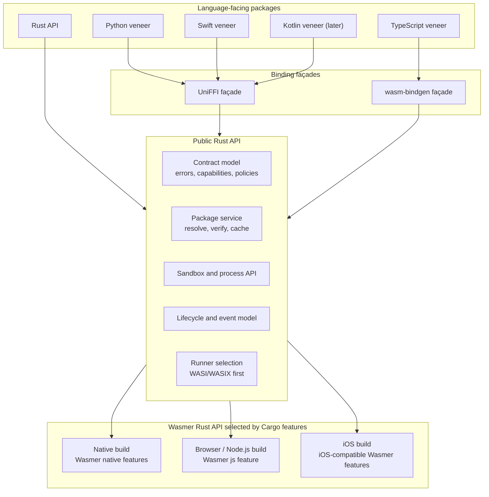
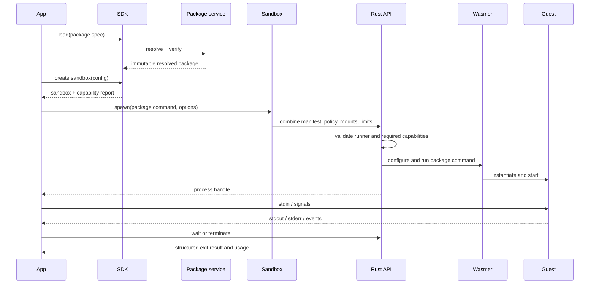
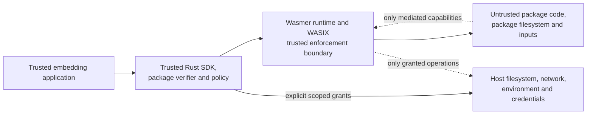

# Universal Wasmer SDK: Phase 1 architecture

Status: draft for review  
Last updated: 2026-07-27  
Scope: architecture only; public API design is Phase 2

## Executive decision

Build one public Rust API that calls the Wasmer Rust API directly. Compile that
API for each target with the appropriate Wasmer Cargo features:

1. Native desktop and server builds enable Wasmer's native features.
2. Browser and Node.js builds compile the Rust API to WebAssembly with Wasmer's
   `js` feature and export it through `wasm-bindgen`.
3. iOS builds use the iOS-compatible Wasmer feature selection and export the
   same Rust API through UniFFI in an XCFramework.

The shared product model is:

```text
SDK -> Package -> Sandbox -> Process
                  |    |
                  |    +-> stdio, signals, wait, events
                  +------ filesystem, mounts, policy, packages, network
```

A package is immutable resolved content. A sandbox is a mutable virtual OS
context. A process is one running package command. The same contract is exposed
to every language. Each compiled target reports the capabilities included by
its Wasmer feature selection and the strength with which limits can be enforced.

There is deliberately no SDK-owned runtime-backend trait and no host-adapter
layer. Wasmer already owns runtime selection. The SDK adds the package,
sandbox, process, policy, and cross-language product model above it. Small
`cfg`-gated modules are acceptable for target compilation and packaging, but
they are implementation details rather than a second runtime abstraction.

## Goals

- Run command-oriented Wasmer packages, including packages such as Python,
  Bash/coreutils, EdgeJS/QuickJS, and PostgreSQL when their declared and
  observed requirements are supported by the current Wasmer build.
- Provide a sandbox-shaped API familiar to users of Riza, Beam, E2B, agentOS,
  and similar execution SDKs.
- Preserve the strongest parts of the current Wasmer JavaScript SDK: registry
  packages, package entrypoints and commands, streamed stdio, directory mounts,
  WASI/WASIX, subprocesses, and browser execution.
- Share behavior and policy logic in Rust while presenting idiomatic Python,
  TypeScript, and Swift APIs.
- Be deny-by-default for host capabilities.
- Support both one-shot commands and long-running, interactive services.
- Make package resolution, caching, and execution reproducible.
- Expose enough structured diagnostics to explain why a package cannot run on
  a target.
- Leave room for additional host languages and runner types without breaking
  the core model.

## Non-goals

- Emulating a complete Linux kernel or promising arbitrary native Linux
  binaries. Guests must be packaged for Wasm with a supported runner.
- Claiming VM-equivalent isolation. Embedded Wasmer is an in-process userspace
  sandbox.
- Making every Wasmer package work on every platform. Compatibility depends on
  runner type, ABI, threads, dynamic linking, networking, and host policy.
- Exposing the low-level `wasmer` crate API uniformly to foreign languages.
  Advanced Rust users can use Wasmer directly.
- Designing the final spelling of the public APIs. Phase 2 will do that with
  language-by-language examples and usability testing.
- Building remote Wasmer Edge orchestration in the first implementation.
- Implementing Docker images, system package managers, browsers, or GUI
  automation inside WASIX.

## Lessons taken from the reference projects

| Reference | Architectural lesson adopted |
| --- | --- |
| Wasmer JavaScript SDK | Keep packages, commands, entrypoints, streamed stdio, shared directories, and WASIX as first-class concepts. Avoid requiring callers to manually compile an atom when package metadata already describes how to run it. |
| Riza | Preserve a very small one-shot path: code/input/configuration in, structured stdout/stderr/exit result out. This should be a convenience over the process model. |
| agentOS | Document trusted host, trusted enforcement layer, and untrusted guest separately. Keep capabilities deny-by-default and host credentials outside the guest. |
| `unix-wasm-sandbox` | Use familiar subprocess semantics, async process handles, bounded output, deterministic package composition, content pinning, and read-only host mounts by default. |
| `wasmer-shell-py` | Support persistent workspaces while being explicit that Wasm isolation is not a kernel or hypervisor boundary. |
| Forge | Keep execution policy in Rust, pin executable content, and use cross-target conformance traces as a release gate. |
| Beam and other cloud sandboxes | Group APIs under sandbox filesystem and process namespaces; distinguish environment configuration from a live instance; make lifecycle explicit. |
| `unix-wasm-sandbox` and Forge | Do not couple “language runtime” to bespoke APIs. Python, JavaScript, Bash, Postgres, and other workloads are package commands using the same process and filesystem primitives. |

The `edx0.dev` page was not available during this research pass, so no
architecture decision relies on undocumented assumptions about it.

## Terminology

- **SDK**: the configured Rust entry point. It owns package resolution, caches,
  defaults, and the Wasmer runtime objects used by this build.
- **Package spec**: an unresolved reference such as `python/python@3.12`, a
  registry URL, a local WEBC path, or WEBC bytes.
- **Resolved package**: immutable package content, resolved dependencies,
  manifest, commands, and content digests.
- **Runner**: code that interprets a package command's runner URI and prepares
  it for execution. WASI/WASIX command runners are the first implementation.
- **Sandbox**: a mutable isolated virtual OS context with a root filesystem,
  mounts, process table, command namespace, policy, and optional virtual
  network.
- **Process**: one execution of one resolved command inside a sandbox.
- **Target build**: the Rust SDK compiled for a target with a specific set of
  Wasmer and SDK Cargo features.
- **Capability**: a feature available in the current target build.
- **Grant**: permission for a guest to use a capability in a sandbox.
- **Enforcement level**: whether a requested limit or isolation property is
  hard, best-effort, or unsupported in the current target build.

## System architecture



### Why the binding façades are separate

The internal Rust types should use traits, generics, borrowed data, rich error
chains, and async streams where those are appropriate. Those types are poor FFI
contracts. The exported façades should instead use:

- reference-counted object handles;
- owned strings and byte arrays;
- records and enums with stable fields;
- async methods returning owned values;
- bounded `read(max_bytes)` and `write(bytes)` operations;
- stable error codes plus structured details.

Both façades call the public Rust API under the hood. This prevents limitations
in UniFFI or `wasm-bindgen` from distorting that API while letting the
TypeScript, Python, and Swift veneers map the same primitive operations to their
native conventions.

## Core domain model

### SDK

An SDK instance owns:

- Wasmer runtime objects configured by the current Cargo features;
- one or more package sources;
- registry authentication used only by the trusted host;
- a raw package blob cache;
- a compiled module cache;
- default sandbox policy;
- logging and metrics configuration;
- a contract version and runtime build fingerprint.

The core should not require mutable global initialization. A language veneer may
offer a default singleton for convenience, but the underlying design must allow
multiple independently configured SDKs in one process.

### Resolved package

A resolved package is immutable and safe to share between sandboxes. It
contains:

- package identity and version;
- the canonical manifest;
- resolved dependencies and their content identities;
- command descriptors and optional entrypoint;
- command runner URIs and annotations;
- the package filesystem layers;
- content digests for every fetched object;
- static requirements discovered from metadata and Wasm imports;
- a reference to verified content in the blob cache.

It contains no live process, mutable filesystem, registry token, or host mount.

### Sandbox

A sandbox owns mutable execution state:

- an overlay/root virtual filesystem;
- mounted portable directories and explicitly granted host directories;
- installed/side-loaded package command namespaces;
- a WASIX process table and control plane;
- environment defaults and working directory;
- process and thread quotas;
- capture/stream backpressure state;
- an optional virtual network;
- a capability policy;
- lifecycle state and event channel.

The default sandbox is ephemeral and isolated from other sandboxes. State
survives only through an explicitly persistent mounted filesystem. Sharing a
mutable `Directory` between sandboxes must be explicit.

### Process

A process handle provides:

- stable process ID within its sandbox;
- state (`starting`, `running`, `exited`, `terminated`, or `failed`);
- stdin writing and closing;
- separate stdout and stderr reading;
- optional PTY I/O where supported;
- `wait`;
- explicit `terminate` and `kill`/hard-stop semantics where supported;
- exit status, termination reason, usage, and limit violations;
- structured events.

A convenience `run` operation is implemented as `spawn`, optionally write and
close stdin, drain bounded output, then `wait`.

### Filesystem provider, directory, and mount

The Rust API defines an object-safe `FileSystem` provider trait for filesystem
implementations that can be mounted into a sandbox. `Directory` is the
portable, mutable in-memory implementation inspired by Wasmer JS. Native host
directories, browser File System API handles, and future application-defined
filesystems use the same mount contract.

This provider is a narrow filesystem capability boundary, not a runtime
backend or general host-adapter layer. The Rust SDK owns path normalization,
mount policy, quotas, error translation, descriptor lifetime, and adaptation
to Wasmer's virtual filesystem API.

The provider contract is asynchronous and byte-oriented. It covers:

- metadata and directory enumeration;
- opening files with explicit read/write/create/truncate/append rights;
- random-access reads and writes;
- create, remove, and rename operations;
- file truncation, flush, and close;
- declared provider capabilities and persistence semantics.

The exact object-safe Rust signatures and foreign-language veneers are a Phase
2 concern. The SDK must not expose Wasmer's internal VFS trait as the universal
contract because its shape may vary with Wasmer releases and may not map
cleanly to asynchronous browser filesystems.

Mount descriptors, rather than raw path maps, carry semantics:

- guest path;
- source filesystem provider, portable directory, or explicit host path;
- read-only/read-write mode;
- visibility and persistence;
- symlink policy;
- optional quota;
- platform-specific capability requirements.

Host mounts are compiled only for targets where Wasmer and the platform can
provide them safely. They are read-only by default.

Browser `FileSystemDirectoryHandle` and OPFS mounts are provided through a
`wasm-bindgen` filesystem veneer. Permission acquisition remains in
application JavaScript and normally requires a user gesture. The SDK validates
permission and provider capabilities before sandbox start. Permission
revocation becomes a guest filesystem error and a structured host event.

A browser mount is live only when the target can bridge asynchronous provider
operations to Wasmer correctly. Importing a directory into a portable
`Directory` is a separate copy operation; the SDK never silently substitutes
it for a requested live mount.

## Execution flow



The Rust API validates execution before starting a guest so it can fail when:

- the command has an unsupported runner;
- the package needs threads, subprocesses, dynamic linking, or networking the
  current build cannot provide;
- requested mounts cannot be represented safely;
- a requested limit lacks the required enforcement strength;
- a package dependency or content digest is missing;
- browser deployment requirements such as cross-origin isolation are absent.

Static preflight cannot predict every runtime syscall. A capability denial that
occurs dynamically must still produce a stable, structured error.

## Package subsystem

### Accepted package sources

The architecture supports:

- registry specifiers (`namespace/name@version`);
- registry or HTTPS URLs;
- WEBC bytes;
- local WEBC files on hosts with a filesystem;
- exact content references and offline package bundles;
- programmatically created packages in a later increment.

Platform veneers may expose only applicable sources. For example, a browser
accepts bytes, URLs, and registry specs but not an arbitrary host path.

### Resolution pipeline

```text
PackageSpec
  -> source selection
  -> bounded download/read
  -> digest verification
  -> WEBC parse and validation
  -> dependency resolution
  -> content-addressed blob admission
  -> ResolvedPackage
```

Resolution must apply compressed and expanded size limits, validate paths, and
perform no guest execution. Registry redirects and authentication are host
policy decisions. Registry tokens never become guest environment variables.

Unversioned registry specs are allowed for development, but resolution records
the exact version and digest for the lifetime of the resolved package.
Reproducible or production usage may require an exact version or expected
digest.

### Installing into a live sandbox

Packages supplied during sandbox creation and packages installed afterward use
the same resolver and validation pipeline. Installing a package into a live
sandbox:

1. resolves, verifies, and prepares the package and its dependencies;
2. validates target capabilities and computes the updated command namespace;
3. atomically extends the sandbox's read-only package layers and command set.

A failure leaves the sandbox unchanged. Installation does not run the package
entrypoint, execute an install script, or invoke a guest operating-system
package manager. Existing processes continue running; commands started after
installation can use the newly installed package. Reinstalling the same exact
package is idempotent. If packages export the same bare command name, callers
must select one through its package's explicit command reference.

### Caches

Use two distinct caches:

1. **Blob cache** keyed by content digest for WEBCs, dependencies, and assets.
2. **Compiled module cache** keyed by module digest plus the complete runtime
   fingerprint: Wasmer version, engine/compiler, target, Wasm features, and
   compilation configuration.

Native, browser, Node.js, and iOS compiled artifacts are not interchangeable.
An artifact cache miss is safe; an incorrect cross-engine hit is not.

On native desktop hosts and Node.js, the default persistent root is
`<project-root>/.wasmer`, where the project root is the working directory
captured when the SDK is constructed unless explicitly configured. Package
content is shared beneath that root; compiled artifacts are partitioned first
by target and then by an engine/code-generation fingerprint.

The logical layout is:

```text
.wasmer/cache-v1/
├── packages/
│   ├── blobs/sha256/
│   ├── trees/sha256/
│   └── refs/
├── compiled/
│   └── <target>/<engine-fingerprint>/modules/sha256/
└── tmp/
```

Cache storage is selected with ordinary target-specific Rust code:

- native: project-local filesystem cache plus an in-memory front cache;
- browser: Cache API/IndexedDB as appropriate;
- Node.js: project-local filesystem-backed or explicitly injected;
- iOS: app-container cache;
- tests: deterministic in-memory implementation.

Every persistent package read is digest-validated. Compiled modules require
stronger trust: Wasmer deserialization can load executable machine code, so
native project-local artifacts must be authenticated as locally generated
using a per-user trust key stored outside the checkout, or compiled persistence
must remain disabled. A checksum stored beside an artifact is not sufficient
against replacement of both files.

Writes use temporary files plus atomic publication, and concurrent processes
coordinate per cache key. Eviction is an implementation policy and does not
change package identity. `.wasmer` is disposable and normally ignored by
source control.

The complete cache contract, layout, trust policy, and configuration are
specified in Phase 2's
[cache design](../phase-2/cache-design.md).

### Package command and runner support

The package subsystem does not assume every command is WASI. A runner registry
maps canonical runner URIs to a `PackageRunner`.

Initial runner support:

- WASI Preview 1 command modules;
- WASIX command modules and package subprocess resolution.

Possible later plug-ins:

- WCGI;
- long-running HTTP service adapters;
- other Wasmer package runner URIs;
- user-provided trusted runners in Rust.

Unknown runners return `unsupported_runner` with the URI and available runners.
They are never guessed.

The sandbox has no ambient shell. A shell is an ordinary installed package
command selected explicitly by an application. Language veneers may provide
safe shell-building syntax, but it must compile to that package command and
must not introduce a second execution engine or consult a host shell.

## Direct Wasmer integration

The public Rust API calls Wasmer directly. It is responsible for:

- inspecting the capabilities compiled into the current build;
- resolving and preparing package commands;
- configuring Wasmer/WASIX objects;
- instantiating commands;
- driving processes and I/O;
- enforcing the limits that Wasmer supports;
- interruption and teardown;
- normalizing events and errors.

The SDK should reuse Wasmer's existing `Engine`, package source/loader, module
cache, virtual filesystem, virtual network, and task-manager APIs. It must not
wrap those concepts in a generic SDK runtime-backend interface.

Target differences use Cargo features and focused `cfg` modules:

| SDK feature | Upstream Wasmer feature direction |
| --- | --- |
| `native` | Wasmer and `wasmer-wasix` native/`sys` features |
| `js` | Wasmer and `wasmer-wasix` `js` features |
| `ios` | The iOS-compatible Wasmer features validated by the device spike |

The exact feature names and iOS combination must be pinned to the chosen Wasmer
release during implementation. The important architectural decision is that
feature selection configures the same Rust API rather than selecting an
SDK-defined backend implementation.

### Native target profile

Primary targets:

- Linux x86_64/aarch64;
- macOS x86_64/aarch64;
- Windows x86_64/aarch64 where upstream dependencies support it.

Characteristics:

- Wasmer native/`sys` features;
- in-memory and host-backed VFS;
- host networking only when explicitly granted;
- filesystem and compiled-module caches.

Compiler and engine selection remain Wasmer concerns and are deferred. Whatever
Wasmer configuration is used becomes part of compiled-cache identity.

### Browser target profile

Characteristics:

- the same Rust API compiled to `wasm32` with Wasmer's `js` feature;
- exported through a narrow `wasm-bindgen` façade;
- execution off the main thread;
- Web Workers for scheduling and WASIX threads;
- async-iterable byte streams with Web Stream adapters in the TypeScript
  veneer;
- portable in-memory directories;
- content caching through browser storage;
- virtual/proxied networking only—never an implied raw host socket;
- explicit deployment diagnostics for secure context, COOP/COEP, worker URLs,
  CSP, and `SharedArrayBuffer`.

The JavaScript veneer should expose a startup self-test. Current Wasmer JS uses
workers and shared memory even for important single-threaded flows, so
deployment requirements must be checked before package execution and reported
as actionable configuration errors.

### Node.js target profile

Node.js uses the same `wasm-bindgen` artifact family required for JavaScript,
not UniFFI or a native Node add-on in the initial design.

It has a distinct TypeScript entrypoint for initialization and packaging:

- `worker_threads`-compatible worker implementation;
- Node filesystem-backed caches and optional mounts;
- Node fetch/HTTP transport;
- Node-specific worker and Wasm asset resolution;
- no references to `document`, DOM-only APIs, or browser globals without an
  adapter.

Browser and Node.js share the public TypeScript contract and most Rust code, but
they are separate tested targets. “Works in browser” is not evidence that it
works in Node.js.

### iOS target profile

Characteristics:

- Rust static library packaged in an XCFramework;
- UniFFI-generated Swift plus a handwritten Swift Package veneer;
- iOS-compatible Wasmer features selected at compile time;
- app-container storage only;
- networking and background execution constrained by Apple platform APIs and
  application entitlements;
- bundled, digest-pinned packages as the first supported distribution mode.

The precise engine is not part of this architecture. Full WASIX package
behavior, threading, dynamic linking, binary size, memory pressure, and device
performance require a Phase 3 build and physical-device proof.

There is also a distribution-policy constraint independent of the runtime:
Apple App Review Guideline 2.5.2 restricts downloading and executing code that
changes app functionality, with limited exceptions. Therefore:

- the SDK can technically accept remote packages;
- the default Swift distribution should emphasize app-bundled packages;
- applications shipping through the App Store must evaluate their own use case;
- the project must not market remote arbitrary-package execution on iOS as
  automatically App-Store-compliant.

## Capability model

The Rust API exposes a `CapabilityReport` before sandbox creation and a resolved
report on the created sandbox. It describes the current compiled target and
includes at least:

- supported ABIs and package runner URIs;
- engine kind and compilation mode;
- threads and shared memory;
- WASIX subprocesses;
- dynamic linking;
- interactive stdio and PTY;
- filesystem implementations and host mounts;
- network modes;
- interruption modes;
- each resource limit's enforcement level;
- deployment prerequisites and detected failures.

The contract uses three enforcement levels:

- **Hard**: the current Wasmer build prevents the guest from exceeding the
  boundary under the documented threat model.
- **Best effort**: the SDK attempts control, but the boundary can overshoot or
  cannot be guaranteed while an in-process guest is executing.
- **Unsupported**: the current build cannot provide the requested property.

Sandbox configuration may specify a minimum acceptable enforcement level.
Creation fails if the current build cannot meet it.

### Initial capability expectations

This table is a design target, not a claim of completed support:

| Capability | Native build | Browser build | Node.js build | iOS build |
| --- | --- | --- | --- | --- |
| WASI/WASIX commands | Target | Target | Target | Validate |
| Registry/URL package loading | Target | Target | Target | Technically possible; distribution-sensitive |
| Portable in-memory VFS | Target | Target | Target | Target |
| Host directory mount | Target | No arbitrary host path | Target | App-container only |
| WASIX subprocesses | Target | Target | Target | Validate |
| Threads/shared memory | Target | Requires cross-origin isolation | Target/validate | Validate |
| Raw host networking | Explicit opt-in | No | Explicit opt-in | Constrained opt-in |
| Virtual/proxied network | Target | Target | Target | Target/validate |
| PTY | Target/validate | Emulated/validate | Emulated/validate | Validate |
No cell becomes a release claim until a conformance test proves it.

## Filesystem architecture

The sandbox root is composed in layers:

```text
package filesystems (read-only)
        +
dependency/side-loaded package filesystems (read-only)
        +
sandbox writable overlay
        +
explicit mounts at guest paths
```

Required invariants:

- Guest paths are normalized absolute paths.
- `..`, symlinks, and mount boundaries cannot escape a granted root.
- Package extraction has byte, entry-count, and depth limits.
- Read-only layers cannot be mutated through aliases.
- Host mounts are canonicalized by the SDK's target-specific filesystem code
  and are read-only by default.
- Cross-sandbox sharing is explicit.
- File APIs are binary-first; text helpers require UTF-8.
- Quotas are enforced inside the portable VFS before allocation/write.

## Process and I/O architecture

### Byte-oriented primitives

The cross-language boundary uses byte chunks:

- `stdin.write(bytes)`;
- `stdin.close()`;
- `stdout.read(max_bytes)`;
- `stderr.read(max_bytes)`;
- `process.wait()`;
- `process.terminate()`.

This avoids UTF-8 corruption and keeps memory bounded. Veneers add:

- JavaScript async-iterable byte streams with `ReadableStream` and
  `WritableStream` adapters;
- Python async iterators and file-like helpers;
- Swift `AsyncSequence<Data>`;
- text decoding helpers with explicit error policy.

### Backpressure and capture

Every stream has bounded buffering. Callers choose:

- inherit to an approved host sink;
- stream with backpressure;
- capture up to a configured limit;
- discard.

If a capture limit is reached, policy chooses whether to:

- truncate and continue;
- close the stream;
- terminate the process with `output_limit_exceeded`.

The default one-shot API should terminate rather than permit unbounded host
memory growth.

### Events

The runtime produces an ordered, versioned event stream:

- process started/exited;
- stdout/stderr chunk;
- limit warning/violation;
- filesystem event where enabled;
- network policy denial;
- diagnostic/log record;
- dropped-events marker when a consumer falls behind.

Callbacks from Rust into foreign code should not be on the execution hot path.
The FFI façade exposes a bounded event reader/subscription handle; language
veneers turn it into their native async abstraction.

### Cancellation

Cancellation is explicit because language runtimes differ and UniFFI's
foreign-future cancellation behavior should not be the sole safety mechanism.

`terminate` requests graceful guest termination when meaningful. `kill` or
hard-stop uses the strongest mechanism available in the current Wasmer build.
The result records whether termination was graceful, forced, timed out, or
unsupported.

## Networking

Network access is disabled by default.

The architecture distinguishes:

1. **Disabled**: no sockets or HTTP host binding.
2. **Virtual/proxied**: guest networking is implemented by a trusted virtual
   network or proxy that can apply policy.
3. **Host network**: native guest sockets reach the host network; this is
   explicit and high trust.

Fine-grained hostname/CIDR/port rules are only advertised when the selected
virtual network can enforce them for all relevant traffic, including DNS.
Passing an allowlist while the current build exposes unrestricted host sockets
is not acceptable.

Browser networking necessarily uses a proxy/overlay compatible with browser
APIs. Node.js and native hosts may offer either virtual/proxied or explicitly
unrestricted host networking. Registry downloads are host control-plane traffic
and are governed separately from guest network grants.

Listening services such as PostgreSQL require:

- a Wasmer build with the necessary WASIX sockets and subprocess support;
- a sandbox-scoped listener;
- an explicit host-side port/connection bridge if the application must connect;
- lifecycle ownership so closing the sandbox closes exposed listeners.

Port exposure is a capability, not a side effect of starting a process.

## Security and trust model



### Defaults

- no host filesystem;
- no host environment forwarding;
- no guest networking;
- no host process spawning;
- no registry credentials in the guest;
- fresh writable VFS per sandbox;
- bounded output;
- bounded package extraction;
- explicit package and dependency identity.

### Important limitation

The Wasm runtime and its WASI/WASIX implementation are part of the trusted
computing base. In embedded mode they share a native process with the
application. A runtime memory-safety bug, unsafe host integration, or
process-wide resource exhaustion may compromise or crash that application.

Therefore the product documentation must say:

- this is a capability-based in-process sandbox;
- it is materially different from executing untrusted code directly;
- it is not a microVM or kernel isolation boundary;
- high-risk multi-tenant workloads should add an outer process/container/VM
  boundary where available.

### Host extensions

Trusted host commands/bindings are useful for agent workflows, but they cross
the sandbox boundary deliberately. They should be:

- registered before sandbox start;
- named and permissioned;
- passed only owned, bounded values;
- invoked through an auditable capability;
- excluded from the default feature set;
- documented as trusted host code.

UniFFI foreign traits can support such adapters later, but they should not be
required for basic process or I/O operation.

## Resource limits

The model includes:

- wall time;
- deterministic instruction/compute budget where supported;
- guest linear memory;
- process count;
- thread count;
- open descriptors;
- captured output bytes;
- VFS bytes and entry count;
- network connections/bytes when using a controlled virtual network;
- package download and expanded size.

Not every limit covers the whole host process:

| Limit | Portable meaning |
| --- | --- |
| Guest memory | Guest linear memories, not all runtime/host RSS |
| Wall time | Elapsed host time until interruption/termination takes effect |
| Compute budget | Wasmer/build-defined deterministic meter with its identity recorded |
| Output | Bytes retained or queued by SDK streams |
| Filesystem | Bytes/entries in quota-aware virtual writable layers |
| Process/thread | WASIX virtual processes/threads owned by the sandbox |
| Host CPU/RSS | Only enforceable through an outer process/container/VM boundary |

Each result reports the limits requested, the enforcement level selected, usage
where measurable, and the first terminating violation. This prevents a field
named `memory_limit` from implying control of memory the current build cannot
bound.

## Async and concurrency model

- The Rust core is async-first.
- Blocking guest execution never runs on a UI/main thread by default.
- Each sandbox serializes lifecycle mutations but may run multiple guest
  processes when its policy and current build allow it.
- Process I/O is independently concurrent.
- Shared `Directory` operations define atomicity at individual filesystem
  operations, not transactions.
- Closing an SDK closes or detaches its sandboxes according to explicit policy.
- Closing a sandbox terminates its processes, closes network bridges, flushes
  eligible filesystem state, and releases package/runtime handles.
- Object finalizers are a last-resort leak guard, never the primary lifecycle.

The FFI layer exposes explicit `close`/`aclose` operations. Python context
managers, Swift structured concurrency helpers, and JavaScript explicit resource
management can wrap those primitives.

## Language binding strategy

### Rust

Rust is the implementation and the most expressive API. Internal traits remain
private or semver-exempt until they are ready for external use. The stable Rust
product API uses the same domain model as other languages.

### UniFFI targets

UniFFI currently provides first-party generation for Swift, Kotlin, and Python.
The first implementation targets Swift and Python; Kotlin follows after the
contract is stable.

Use a dedicated `wasmer-sdk-uniffi` crate containing:

- exported object handles for SDK, package, sandbox, process, directory, stream,
  and subscription;
- FFI-safe records/enums;
- async operations;
- one stable error type with machine-readable code and structured context.

Generated code is packaged behind handwritten veneers:

- Python wheel containing generated Python, the native library, type hints, and
  a small Pythonic layer;
- Swift Package containing generated Swift, a binary XCFramework target, and a
  Swift-native layer;
- Kotlin package later, with coroutine and resource wrappers.

This is needed because UniFFI generates bindings but does not build or
distribute the native binaries, and because generated naming alone will not
provide excellent language-specific ergonomics.

Potential UniFFI risks to validate:

- Swift 6 `Sendable` behavior for async generated code;
- foreign callback lifetime and reentrancy;
- async cancellation mapping;
- large byte-array copy costs;
- packaging universal wheels and XCFramework slices.

### JavaScript

JavaScript is not generated through UniFFI. A `wasmer-sdk-web` crate compiles to
Wasm and exports coarse operations with `wasm-bindgen`.

A handwritten TypeScript package owns:

- browser and Node.js entrypoints;
- worker creation and asset URL resolution;
- TypeScript discriminated unions;
- Web Stream adapters;
- idiomatic errors;
- package bundler integration;
- environment self-tests.

Do not export every Rust method directly. Crossing JS/Wasm and worker boundaries
per output byte or filesystem entry would be inefficient. Use bounded chunks
and batch operations.

## Error contract

All languages receive the same stable error categories:

- `invalid_argument`;
- `invalid_state`;
- `package_not_found`;
- `package_resolution_failed`;
- `integrity_mismatch`;
- `unsupported_runner`;
- `unsupported_capability`;
- `capability_denied`;
- `limit_not_enforceable`;
- `mount_failed`;
- `compile_failed`;
- `instantiate_failed`;
- `process_failed`;
- `process_terminated`;
- `timeout`;
- `output_limit_exceeded`;
- `io`;
- `network`;
- `cache`;
- `runtime_unavailable`;
- `internal`.

An error contains:

- stable code;
- human-readable message;
- operation;
- Wasmer build and target;
- optional package/command/process identity;
- retryability;
- structured details;
- a redacted causal chain for diagnostics.

Rust implementation errors and JavaScript stack strings do not become the
public compatibility contract. Unknown internal failures map to `internal`
without losing diagnostic detail in trusted logs.

## Proposed repository boundaries

This is a proposed Phase 3 workspace, not implementation committed in Phase 1:

```text
/
├── crates/
│   ├── wasmer-sdk/              # public Rust API; calls Wasmer directly
│   │   └── src/
│   │       ├── package/         # sources, locks, verification, cache
│   │       ├── sandbox/         # sandbox, process, filesystem, lifecycle
│   │       ├── runner/          # package runner selection
│   │       └── target/          # small cfg-gated target details
│   ├── wasmer-sdk-uniffi/       # UniFFI façade over wasmer-sdk
│   ├── wasmer-sdk-js/           # wasm-bindgen façade over wasmer-sdk
│   └── wasmer-sdk-testkit/      # target-neutral conformance suite
├── bindings/
│   ├── python/                  # generated internals + Python veneer/packaging
│   ├── swift/                   # generated internals + Swift Package/XCFramework
│   └── javascript/              # TypeScript browser and Node.js package
├── examples/
│   ├── browser/
│   ├── node/
│   ├── python/
│   └── swift/
├── conformance/
│   ├── packages/
│   ├── fixtures/
│   └── expected-traces/
└── docs/
    ├── phase-1/
    ├── phase-2/
    └── phase-3/
```

`wasmer-sdk` is the product API and calls Wasmer directly. Its `native`, `js`,
and `ios` Cargo features select the relevant upstream Wasmer features.
`wasmer-sdk-uniffi` and `wasmer-sdk-js` depend on that crate with the appropriate
feature set and contain only boundary conversion, initialization, and export
code. They do not contain their own sandbox or runtime implementations.

## Illustrative API shape

These snippets establish object ownership only. Phase 2 may rename or reshape
them.

```text
sdk = WasmerSdk.create(config)
capabilities = sdk.capabilities()

python = await sdk.packages.load("python/python@3.12")
sandbox = await sdk.sandboxes.create({
  filesystem: ephemeral(),
  network: disabled(),
  limits: { wall_time: 10s, output_bytes: 16MiB }
})

process = await sandbox.spawn(
  python.entrypoint,
  args=["-c", "print(6 * 7)"]
)
result = await process.wait()
```

Long-running and multi-package behavior uses the same model:

```text
await sandbox.install_package(bash)
await sandbox.install_package(coreutils)
postgres = await sandbox.command(postgres_package.command("postgres")).spawn()
endpoint = await sandbox.network.bridge(postgres, guest_port=5432)
```

The architecture does not require installation to copy package bytes. It means
the package's commands and filesystem layers become available to the sandbox's
package resolver and process namespace.

## Versioning

Track separate identities:

- **SDK semantic version**: source-level product API.
- **Contract version**: records, events, errors, lifecycle semantics, and
  cross-target conformance.
- **Runtime build fingerprint**: Wasmer/engine/compiler/target/features and
  configuration identity for compiled cache safety.
- **Runner implementation identity**: behavior relevant to package execution.

Adding a target capability is normally backward-compatible. Weakening an
enforcement guarantee or changing event/result semantics requires an explicit
contract decision.

## Conformance and verification strategy

The same black-box suite runs against every target build and language façade.

### Contract tests

- package resolution and digest failures;
- atomic package installation after sandbox creation;
- command and entrypoint selection;
- args, environment, cwd, and exit status;
- binary stdin/stdout/stderr with chunk boundaries;
- interactive process I/O;
- cancellation and timeout;
- filesystem operations and mount traversal;
- read-only enforcement;
- package subprocess resolution;
- network denial and supported network modes;
- output, filesystem, process, thread, and memory limits;
- lifecycle cleanup and repeated creation;
- stable error codes and events;
- concurrent independent sandboxes.

### Package compatibility matrix

Phase 3 should continuously test pinned representatives:

- a minimal WASI module;
- Bash plus coreutils;
- Python;
- EdgeJS/QuickJS;
- PostgreSQL;
- a threaded WASIX program;
- a subprocess-heavy package;
- a dynamic-linking package;
- a long-running TCP service;
- a package with multiple commands and dependencies.

For each target build, publish:

- resolved package digest;
- startup and exit behavior;
- required capabilities;
- pass/fail/unsupported status with reason;
- peak guest memory and artifact sizes where measurable.

“Any package” becomes a measurable compatibility goal, not an unqualified
promise.

### Language proofs

- Python async one-shot plus an interactive Bash session.
- Browser Python or EdgeJS with mounted files and streaming output.
- Node.js long-running process and filesystem mount.
- Swift/iOS bundled package on a physical device, including cancellation and
  app-container files.

### Release gates

- no unexplained cross-target difference in canonical event traces;
- no silent capability downgrade;
- all cached artifacts revalidated;
- no native compiled artifact deserialized without authenticated provenance;
- package pins and fixture digests reviewed;
- teardown/leak tests pass under repetition;
- browser worker and deployment self-tests pass;
- Swift device and simulator artifacts build;
- generated bindings match the checked contract version.

## Risk register

| Risk | Impact | Mitigation / Phase 3 proof |
| --- | --- | --- |
| Upstream `wasmer-wasix` APIs are version-sensitive and parts are documented as experimental. | High | Keep usage private behind the stable Rust product API; pin versions; maintain focused integration tests. |
| The iOS Wasmer feature set supports core Wasm but not the WASIX behavior needed by large packages. | High | First technical spike: bundled Bash and Python on a physical device before committing to full Swift scope. |
| App Store rules restrict downloaded executable packages. | High for distribution | Lead with bundled packages; document policy; keep remote loading opt-in and application-owned. |
| Browser shared-memory and worker requirements complicate deployment. | High | Startup self-test, actionable diagnostics, official bundler recipes, and a single-thread fallback only if upstream behavior supports it. |
| Node.js diverges from browser Web APIs. | High | Separate TypeScript entrypoint and full Node conformance; never rely on browser tests alone. |
| In-process timeouts cannot always stop hostile or stuck work immediately. | High | Expose enforcement level; use Wasmer interruption where available and browser/Node worker termination. |
| General host callbacks through FFI deadlock or re-enter the runtime. | Medium | Keep general callbacks off hot paths; reject same-operation reentrancy; add host bindings only after a focused test. |
| Wasmer's mixed synchronous/asynchronous VFS shape cannot safely await the browser File System API. | High for live browser mounts | Prototype an OPFS and user-selected-directory provider in a worker before freezing the provider ABI; expose live mounts only as a capability; keep explicit import-to-`Directory` available. |
| An attacker plants a native compiled artifact in a project-local `.wasmer` directory. | Critical | Authenticate artifact bytes and metadata with a per-user key stored outside the checkout; otherwise treat the entry as a miss and compile validated Wasm. |
| Large package and filesystem copies make FFI expensive. | Medium | Content caches, bounded chunks, batch filesystem operations, and profiling before freezing API granularities. |
| Package runner diversity exceeds the initial WASI/WASIX runner. | Medium | Runner registry with explicit unsupported errors; add runner plug-ins based on compatibility data. |
| Fine-grained network policy is bypassed by unrestricted sockets. | High | Advertise rules only with an enforcing virtual network; otherwise expose only disabled vs explicit host-network modes. |
| Native runtime crash takes down the embedding application. | High for hostile multi-tenancy | Maintain an honest threat model and recommend an outer process/container/VM boundary for high-risk deployments. |
| Generated bindings are technically consistent but unidiomatic. | Medium | Handwritten public veneers and Phase 2 examples reviewed by users of each language. |
| “Universal” causes users to assume feature parity. | High | Runtime capability report, package preflight, compatibility matrix, and no silent fallback. |

## Phase 2 inputs

Phase 2 should design the developer experience within these fixed constraints:

- top-level SDK/runtime creation;
- package loading and pinning;
- one-shot `run` versus `spawn`;
- sandbox builder and lifecycle;
- filesystem and mount ergonomics;
- process streams, PTY, and events;
- errors and capability preflight;
- code-interpreter conveniences built from packages;
- equivalent idiomatic examples in TypeScript, Python, Swift, and Rust;
- migration path from current Wasmer JS.

It should compare at least:

- Wasmer JS's package/command API;
- Python `subprocess` and JavaScript child-process conventions;
- Riza's one-shot code execution;
- Beam/E2B-style `sandbox.process` and `sandbox.fs`;
- agentOS capability configuration;
- language-specific resource management and async conventions.

## Phase 3 order of implementation

1. Prove the direct Rust API with a native minimal WASI package.
2. Implement package resolution, the project-local package cache, and
   the portable VFS.
3. Add WASIX package commands, streamed process I/O, and capability reporting.
   Prove package installation both during and after sandbox creation.
4. Add target-partitioned compiled caching and prove authenticated provenance
   before enabling persistent native deserialization.
5. Compile the same Rust API with Wasmer's `js` feature and prove one browser
   package through `wasm-bindgen`.
6. Add the Node.js TypeScript entrypoint as an independent conformance target.
7. Add UniFFI façade and Python veneer.
8. Perform the iOS engine/device spike before building the complete Swift API.
9. Add Bash, Python, EdgeJS/QuickJS, and PostgreSQL compatibility fixtures.
10. Prove the object-safe filesystem provider with a native test filesystem,
   OPFS, and a user-selected browser directory handle.
11. Add advanced networking and PTY only after the basic contract is stable.

## Phase 1 completion criteria

Phase 1 is complete when the project agrees on:

- package/sandbox/process/directory as the primary model;
- one public Rust API that calls Wasmer directly;
- target selection through Wasmer Cargo features rather than an SDK runtime
  backend or host-adapter layer;
- UniFFI versus `wasm-bindgen` boundary;
- deny-by-default security and honest isolation statement;
- capability/enforcement reporting;
- content-addressed resolution and caching;
- a project-local `.wasmer` cache with target-partitioned, authenticated
  compiled artifacts;
- runner extensibility;
- an object-safe filesystem-provider boundary with capability-gated live
  browser mounts;
- cross-target conformance as a release gate;
- the iOS and browser risks that must be proved before broad claims.

The remaining questions in the [decision log](decisions.md) do not block Phase
2, but they do block particular Phase 3 release claims.

## Research sources

Accessed 2026-07-27:

- [Wasmer JavaScript SDK introduction](https://docs.wasmer.io/sdk/wasmer-js/)
- [Wasmer JavaScript SDK repository](https://github.com/wasmerio/wasmer-js)
- [Wasmer JS filesystem API](https://docs.wasmer.io/sdk/wasmer-js/how-to/use-filesystem/)
- [Wasmer JS troubleshooting and browser deployment requirements](https://docs.wasmer.io/sdk/wasmer-js/explainers/troubleshooting/)
- [Wasmer runtime Rust API](https://wasmerio.github.io/wasmer/crates/doc/wasmer/)
- [`wasmer-wasix` Rust API](https://wasmerio.github.io/wasmer/crates/doc/wasmer_wasix/)
- [Wasmer CLI package execution](https://docs.wasmer.io/runtime/cli/)
- [Wasmer package manifest](https://docs.wasmer.io/registry/manifest/)
- [UniFFI user guide](https://mozilla.github.io/uniffi-rs/latest/)
- [UniFFI Swift bindings](https://mozilla.github.io/uniffi-rs/latest/swift/overview.html)
- [UniFFI foreign traits](https://mozilla.github.io/uniffi-rs/latest/foreign_traits.html)
- [wasm-bindgen Web Worker example](https://wasm-bindgen.github.io/wasm-bindgen/examples/wasm-in-web-worker.html)
- [MDN File System API](https://developer.mozilla.org/en-US/docs/Web/API/File_System_API)
- [Wasmer 7.1 virtual filesystem source](https://github.com/wasmerio/wasmer/blob/v7.1.0/lib/virtual-fs/src/lib.rs)
- [Riza introduction](https://docs.riza.io/introduction)
- [agentOS documentation](https://agentos-sdk.dev/docs/)
- [agentOS security model](https://agentos-sdk.dev/docs/security-model/)
- [Beam sandbox overview](https://docs.beam.cloud/v2/sandbox/overview)
- [`unix-wasm-sandbox`](https://github.com/tanmay-bakshi/unix-wasm-sandbox)
- [`wasmer-shell-py`](https://github.com/boweiliu/wasmer-shell-py)
- [Forge](https://github.com/wasm-oj/forge)
- [Apple App Review Guidelines](https://developer.apple.com/app-store/review/guidelines/)
- [Apple XCFramework distribution](https://developer.apple.com/documentation/xcode/creating-a-multi-platform-binary-framework-bundle)
