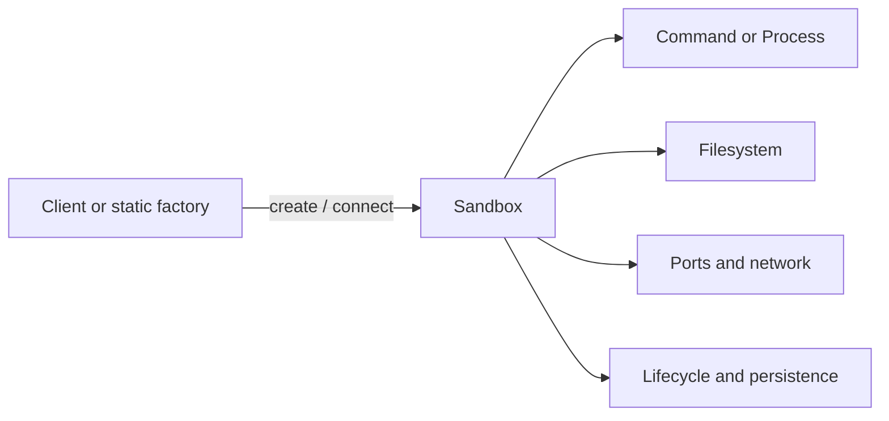

# Sandbox SDK comparison and API revision

Status: complete research pass for review  
Last updated: 2026-07-27

## 1. Question

Should the universal Wasmer SDK expose a top-level operation like this?

```ts
await client.run("python/python@=3.13.5", {
  args: ["-c", "print('hello')"],
});
```

Or should every command execute through an explicit `Sandbox`?

This document answers that question by comparing the current Vercel Sandbox,
Modal Sandbox, E2B Sandbox, and Daytona Sandbox APIs. It focuses on their
public object models and developer experience rather than their different
cloud backends.

The conclusion is:

> Do not include a base `Wasmer.run()` in the v1 core. A sandbox should be the
> only execution boundary, including for a single command.

The short path remains short:

```ts
await using sandbox = await wasmer.sandboxes.create({
  packages: ["python/python@=3.13.5"],
});

const output = await sandbox
  .command("python", ["-c", "print('hello')"])
  .run();
```

This costs one explicit creation step, but it leaves packages, files, mounts,
environment, policy, limits, processes, and cleanup attached to the object
that actually owns them.

## 2. Research scope

The review used the official documentation and current SDK references
available on 2026-07-27:

- [Vercel Sandbox overview](https://vercel.com/docs/sandbox),
  [JavaScript SDK reference](https://vercel.com/docs/sandbox/sdk-reference),
  [persistent sandboxes](https://vercel.com/docs/sandbox/concepts/persistent-sandboxes),
  and [snapshots](https://vercel.com/docs/sandbox/concepts/snapshots)
- [Modal Sandboxes guide](https://modal.com/docs/guide/sandboxes),
  [running commands](https://modal.com/docs/guide/sandbox-spawn),
  [filesystem access](https://modal.com/docs/guide/sandbox-files),
  [snapshots](https://modal.com/docs/guide/sandbox-snapshots),
  and [JavaScript `Sandbox` reference](https://modal.com/docs/sdk/js/latest/Sandbox)
- [E2B quickstart](https://e2b.dev/docs/quickstart),
  [sandbox lifecycle](https://e2b.dev/docs/sandbox),
  [commands](https://e2b.dev/docs/commands),
  [persistence](https://e2b.dev/docs/sandbox/persistence),
  and [JavaScript `Sandbox` reference](https://e2b.dev/docs/sdk-reference/js-sdk/v2.29.1/sandbox)
- [Daytona TypeScript SDK](https://www.daytona.io/docs/en/typescript-sdk/),
  [`Daytona` reference](https://www.daytona.io/docs/en/typescript-sdk/daytona/),
  [`Sandbox` reference](https://www.daytona.io/docs/en/typescript-sdk/sandbox/),
  [`Process` reference](https://www.daytona.io/docs/en/typescript-sdk/process/),
  and [persistence](https://www.daytona.io/docs/en/persistence/)
- [Bun Shell](https://bun.sh/docs/runtime/shell) for safe tagged-template
  interpolation
- [zx quoting](https://google.github.io/zx/quotes) for escaped scalar and
  array interpolation
- [MDN `ReadableStream`](https://developer.mozilla.org/en-US/docs/Web/API/ReadableStream)
  for Web Stream interoperability and async iteration

These products evolve quickly. The observations below describe their APIs at
that date, not a permanent claim about every release.

References to snapshots and forks below describe competitor capabilities only.
They are not part of the proposed Wasmer SDK surface.

## 3. The shared shape

Despite substantial differences in runtime and persistence, all four products
share the same central relationship:



None of the four presents client-level `run(environment, command)` as its
canonical SDK model. They first create or retrieve a sandbox and then execute
inside it.

That is not merely cloud-resource ceremony. It gives every operation an
unambiguous owner.

## 4. Vercel Sandbox

### 4.1 Public shape

Vercel uses a static factory:

```ts
const sandbox = await Sandbox.create({
  runtime: "python3.13",
  timeout: 5 * 60 * 1000,
});

const result = await sandbox.runCommand("python", [
  "-c",
  "print('hello')",
]);
```

Its current reference separates:

- `Sandbox`: a named, persistent entity;
- `Session`: one running VM incarnation of that sandbox;
- `Command`: a running or detached command;
- `CommandFinished`: a completed command with exit metadata;
- `FileSystem`, `Snapshot`, `Drive`, `SandboxUser`, and `NetworkPolicy`.

Sandboxes are persistent by default in the current SDK. Stopping a persistent
sandbox snapshots its filesystem, and a later operation may resume it.
`Sandbox.get()` and `Sandbox.getOrCreate()` make identity and reconnection
first-class.

### 4.2 Command model

`sandbox.runCommand()`:

- accepts a program and argument array;
- waits by default;
- returns a live `Command` when `detached: true`;
- supports stdout and stderr sinks;
- reports nonzero exit codes in the result;
- lets a detached command be retrieved later by command ID.

This is approachable, but the return type changes with an option. Separate
`Command.run()` and `Command.spawn()` terminals are easier to teach and type
across Rust, JavaScript, Python, and Swift.

### 4.3 Environment construction

`Sandbox.create()` owns runtime/image selection, Git/tarball/snapshot sources,
resources, ports, timeout, network policy, environment, drives, tags, and
persistence. That concentration is useful: the environment is completely
described before a command starts.

Vercel also distinguishes:

- sandbox identity from a running session;
- stopping from deletion;
- a session timeout from persistent filesystem lifetime;
- sandbox-default environment from per-command overrides;
- sandbox policy from command execution.

### 4.4 Files, ports, and policy

Vercel exposes both direct conveniences such as `writeFiles()` and a more
complete `sandbox.fs` interface. Ports must be declared and are resolved with
`sandbox.domain(port)`. Network policy can be changed while the sandbox is
running.

### 4.5 What to learn

Adopt:

- explicit sandbox creation before execution;
- argv-first commands;
- nonzero exit as result data;
- sandbox defaults with per-command overrides;
- separate command and sandbox lifetimes;
- deterministic stop/close and distinct destructive deletion where
  persistence exists;
- snapshots and forks as environment reuse mechanisms.

Avoid copying:

- a command method whose return type changes through `detached`;
- flat duplication of a complete filesystem API when `sandbox.fs` already
  provides a coherent home;
- cloud concepts such as public domains, named remote sessions, and billing
  metadata in the universal embedded contract.

## 5. Modal Sandbox

### 5.1 Public shape

Modal JavaScript creates a sandbox through a client-owned collection:

```ts
const modal = new ModalClient();
const app = await modal.apps.fromName("my-app", {
  createIfMissing: true,
});
const image = modal.images.fromRegistry("python:3.13-slim");
const sandbox = await modal.sandboxes.create(app, image);

const process = await sandbox.exec([
  "python",
  "-c",
  "print('hello')",
]);
```

The image and app are explicit construction inputs. The sandbox can also have
a main entrypoint command, while `exec()` starts additional processes.

### 5.2 Command model

`sandbox.exec()` always returns a `ContainerProcess`. Its stdin, stdout, and
stderr are live streams, and `wait()` returns the exit code. Captured output is
obtained by reading the streams after completion.

This is the cleanest single primitive of the four: starting a command always
produces a process. It is also more ceremony for the common “run and collect”
case. The Wasmer API can preserve Modal's honest process ownership while
adding a distinct captured `run()` convenience over `spawn()` plus `wait()`.

### 5.3 Lifecycle and readiness

Modal makes lifecycle unusually explicit:

- created, scheduled, started, optionally ready, then finished;
- maximum lifetime and idle timeout are separate;
- readiness probes may check a port or execute a command;
- `waitUntilReady()` is distinct from creation;
- `terminate()` stops execution, while `detach()` releases local client
  resources without terminating the remote sandbox.

The readiness model is particularly valuable for Wasmer packages that expose
Postgres, an HTTP server, or another long-running service. Starting a process
and establishing readiness are different operations.

### 5.4 Environment construction and storage

Images, volumes, cloud bucket mounts, workdir, environment, secrets, resource
limits, ports, network rules, and regions belong to sandbox creation. The
filesystem API handles direct reads and writes, while volumes provide storage
that outlives one sandbox. Filesystem, directory, and experimental memory
snapshots have deliberately different semantics.

### 5.5 What to learn

Adopt:

- the sandbox as the owner of execution;
- a live `Process` with real streams;
- explicit sandbox lifetime versus command timeout;
- service readiness as a first-class concern;
- clear snapshot semantics rather than one vague “save state” operation.

Avoid copying:

- requiring every captured command user to manually drain and join streams;
- exposing an entrypoint command at sandbox creation in v1 before its
  interaction with cleanup and readiness is proven;
- Modal application, deployment, cloud, and image-builder concepts in an
  embedded package SDK.

## 6. E2B Sandbox

### 6.1 Public shape

E2B uses a static factory and capability namespaces:

```ts
const sandbox = await Sandbox.create();
const result = await sandbox.commands.run("ls -la");
const files = await sandbox.files.list("/");
```

The `Sandbox` owns `commands`, `files`, `git`, and `pty` modules. A specialized
code-interpreter package adds `runCode()`, but command execution remains
sandbox-scoped.

### 6.2 Command model

`commands.run()` accepts shell command text. It waits by default and supports:

- stdout and stderr callbacks;
- `background: true`;
- a command handle that can later be waited for or killed.

The namespaces keep a large surface navigable. However, accepting command-line
text as the default makes shell parsing, quoting, and injection part of the
common path. A Wasmer SDK spanning browsers, Rust, Python, and Swift should
keep program and arguments separate. If an application needs shell parsing,
it should install a shell package and execute that command explicitly.

### 6.3 Lifecycle and persistence

E2B makes sandbox identity durable:

- `Sandbox.create()` starts a sandbox;
- `pause()` preserves filesystem and memory;
- `connect()` resumes or reconnects by ID;
- `kill()` is terminal;
- timeout may trigger pause;
- snapshots persist beyond sandbox deletion and can seed new sandboxes;
- forks branch running state.

It also exposes metrics, metadata, public hosts, traffic tokens, network
updates, SSH, upload/download URLs, volumes, and filesystem watching.

### 6.4 Templates and code interpretation

E2B templates define the environment before runtime. Start and ready commands
can be captured into a template snapshot. Its code interpreter is explicitly a
higher-level product with persistent language contexts and rich execution
artifacts.

This validates the proposed Wasmer split:

- packages construct the general environment;
- language-aware code interpretation can be a recipe or separate package;
- it should not distort the universal core around `runCode(language, code)`.

### 6.5 What to learn

Adopt:

- capability grouping once a subsystem becomes large;
- specialized code-interpreter APIs above the general sandbox;
- IDs and explicit process ownership;
- dedicated PTY behavior rather than pretending a terminal is ordinary stdio.

Avoid copying:

- a shell string as the canonical command form;
- a boolean that changes a completed result into a background handle;
- putting every frequent operation behind an extra namespace before the
  surface needs it.

## 7. Daytona Sandbox

### 7.1 Public shape

Daytona uses a configured client and a rich sandbox object:

```ts
const daytona = new Daytona();
const sandbox = await daytona.create({
  language: "typescript",
});

const response = await sandbox.process.executeCommand(
  'echo "hello"',
);
```

The sandbox exposes operation façades:

- `process`;
- `fs`;
- `git`;
- `codeInterpreter`;
- `computerUse`.

The client owns create, get, list, start, stop, delete, snapshot, volume, and
secret services.

### 7.2 Command and interpreter model

Daytona distinguishes several execution modes:

- stateless code execution;
- a stateful Python interpreter;
- captured shell command execution;
- long-running sessions that maintain shell state across commands;
- PTY sessions;
- streamed logs.

This breadth is powerful, but it also shows why “run” cannot carry every
meaning. Stateful language contexts, shell sessions, terminal processes, and
captured argv execution are different abstractions.

### 7.3 Lifecycle and persistence

Daytona is persistent by default and exposes the broadest lifecycle:

- start and stop preserve filesystem identity;
- pause and resume can preserve memory where the sandbox class supports it;
- archive moves stopped state to cheaper storage;
- delete is terminal;
- independent auto-stop, auto-pause, auto-archive, auto-delete, and TTL
  controls exist;
- snapshots, forks, and volumes preserve or branch state.

It also distinguishes ephemeral sandboxes explicitly. This is a useful naming
lesson, but an embedded Wasmer `Sandbox` should not imply remote persistence.
Its lifetime is the owning process unless snapshotted or backed by an external
filesystem.

### 7.4 What to learn

Adopt:

- a client as the owner of configuration and creation;
- subsystem façades for large optional features;
- explicit stateful interpreter and terminal abstractions above ordinary
  commands;
- lifecycle terms with precise persistence meanings;
- environment source as package/image/snapshot plus mounts.

Avoid copying:

- a large lifecycle state machine before the embedded implementation needs it;
- shell text as the lowest-level command API;
- mixing code-interpreter artifacts into the universal `Output`;
- exposing target/cloud management concepts through the portable core.

## 8. Comparative summary

| Axis | Vercel | Modal | E2B | Daytona | Wasmer direction |
| --- | --- | --- | --- | --- | --- |
| Execution owner | `Sandbox` | `Sandbox` | `Sandbox.commands` | `Sandbox.process` | `Sandbox` |
| Factory owner | Static class | Client collection | Static class | Configured client | Configured `Wasmer` |
| Base client `run` | No | No | No | No | No |
| Canonical command | Program + argv | argv array | Shell text | Shell text | Program + argv |
| Captured/live split | `detached` option | Always process | `background` option | Separate APIs/sessions | `Command.run` / `Command.spawn` |
| Files | Flat helpers + `fs` | `filesystem` | `files` | `fs` | `fs` |
| Language code API | No core primitive | Built as a recipe | Specialized interpreter | Separate interpreter | Recipe/package above core |
| Sandbox timeout | Yes | Lifetime + idle | TTL/timeout | Several lifecycle timers | Optional lifetime; precise name |
| Command timeout | Abort/detached control | Yes | Yes | Yes | `timeoutMs` |
| Readiness | User workflow | Built-in probes | Template ready command | Sessions/previews | Add service readiness deliberately |
| Persistence | Named sandbox + sessions | Snapshot/volume oriented | Pause/snapshot/fork | Persistent by default | External mounted FS only; no hidden persistence |
| Cleanup | Stop/delete | Terminate/detach | Pause/kill | Stop/pause/delete | `close()` |

## 9. Why base `Wasmer.run()` is the wrong abstraction

### 9.1 It creates two meanings of `run`

With the earlier proposal:

```ts
client.run(packageSource, options);
sandbox.run(command, options);
```

The same word resolves a package in one location and a command in another.
Adding a `CommandRef` overload blurs the distinction further.

With the revised proposal:

```ts
wasmer.packages.load(source);
wasmer.sandboxes.create(options);
sandbox.command(command, args, options).run();
```

Every verb has one job.

### 9.2 It hides the owner of policy and state

A one-shot helper still needs to decide:

- which packages are installed;
- what filesystem exists;
- which mounts are attached;
- what environment and cwd apply;
- whether network is available;
- which limits are enforceable;
- where spawned children belong;
- how output and termination are handled;
- when cleanup occurs.

Those are sandbox decisions. Hiding the object does not remove them; it only
makes the defaults harder to inspect and extend.

### 9.3 It makes future features awkward

Service readiness, dynamic package installation, package collisions, mounted
browser filesystems, background children, and port connections all need an
environment handle. A top-level `run()` either grows into a second
`SandboxOptions` or becomes the path that cannot use important features.

### 9.4 It weakens the package model

A package is immutable software content. It is not a process and should not
own mutable files, mounts, environment, or children. Installing packages into
a sandbox, then resolving commands from that sandbox, keeps the model honest.

### 9.5 One extra line is useful friction

The explicit line communicates that execution creates an isolated environment
with a lifecycle:

```ts
await using sandbox = await wasmer.sandboxes.create({
  packages: ["python/python@=3.13.5"],
});
```

That is not accidental verbosity. It is where security and resource choices
belong.

## 10. Revised core API

### 10.1 JavaScript

```ts
const wasmer = new Wasmer();

await using sandbox = await wasmer.sandboxes.create({
  packages: ["python/python@=3.13.5"],
  files: {
    "main.py": "print(sum(range(10)))",
  },
  network: { mode: "disabled" },
});

const output = await sandbox.command("python", ["main.py"]).run({
  timeoutMs: 5_000,
  outputBytes: 1024 * 1024,
});

console.log(output.text());
```

Live execution remains visibly different:

```ts
const process = await sandbox.command("python", ["-i"]).spawn({
  terminal: true,
});
```

Shell parsing remains explicit and package-provided:

```ts
await sandbox.installPackage("wasmer/bash@1.0.25", {
  asShell: "bash",
});
const output = await sandbox
  .sh`find /workspace -type f | sort`
  .run();
```

### 10.2 Rust

```rust
let sandbox = wasmer
    .sandboxes().create()
    .package("python/python@=3.13.5")
    .file("/workspace/main.py", b"print(sum(range(10)))")
    .network(NetworkPolicy::Disabled)
    .await?;

let output = sandbox
    .command("python")
    .arg("/workspace/main.py")
    .timeout(Duration::from_secs(5))
    .run()
    .await?;

sandbox.close().await?;
```

The Rust command builder still mirrors `std::process::Command`; removing
`Wasmer::run()` makes that analogy stronger because commands only exist inside
an environment.

### 10.3 What `sandboxes.create()` means

In the embedded SDK, creation means:

1. resolve packages and dependencies through the configured client;
2. validate target capabilities and requested enforcement;
3. assemble the virtual filesystem and mounts;
4. construct the Wasmer store and package command environment;
5. return an open sandbox that owns every process it starts.

The sandbox is initially process-free. Creation does not secretly execute a
package entrypoint.

### 10.4 Short-lived and long-lived use are one model

There is no separate “one-shot sandbox” type:

- create, run once, close is short-lived use;
- create, run many times, close is session use;
- create, spawn services, wait for readiness, close is service use;
- mount an external persistent filesystem when state must outlive the sandbox.

`await using` and language-specific context management make deterministic
cleanup concise without inventing a parallel execution path.

## 11. Additional API refinements from the comparison

### 11.1 Use `timeoutMs` for a command

The earlier `wallTimeMs` is precise but unlike the dominant SDK vocabulary.
Use:

- `timeoutMs` on `Command.run()` and `Command.spawn()`;
- `lifetimeMs` only if the sandbox itself needs a maximum lifetime;
- `idleTimeoutMs` only if the implementation can define activity precisely.

Rust should continue using typed `Duration`.

### 11.2 Keep `run` and `spawn` separate

Do not copy `detached: true` or `background: true`. A boolean should not change
the return type:

```ts
const command = sandbox.command(program, args, commandOptions);
const output: Output = await command.run(runOptions);
const process: Process = await command.spawn(spawnOptions);
```

`Command.run()` is specified as `Command.spawn()` followed by bounded `wait`;
it is not an independent runtime path.

### 11.3 Put execution on `Command`

E2B and Daytona use `commands` or `process` namespaces, while Vercel and Modal
put execution directly on `Sandbox`. Wasmer benefits from a small intermediate
object that separates description from execution:

```ts
const command = sandbox.command("python", args);
await command.run();
await command.spawn();
```

This matches Rust's command-builder grammar, keeps `Sandbox` focused on the
environment, and allows command descriptions to be reused. If process listing,
reconnection, signals, sessions, and metrics grow substantially, they can
later live under `sandbox.processes` without moving command construction.

### 11.4 Add readiness only with precise semantics

A service recipe needs a portable wait mechanism. The likely shape is:

```ts
await sandbox.ports.wait(5432, { timeoutMs: 10_000 });
```

An exec-based readiness probe can be composed with
`sandbox.command(...).run()`. This should enter v1 only after Phase 3 proves
how guest networking and scheduling behave on browser, Node.js, native, and
iOS targets.

### 11.5 Keep code interpreters above the core

E2B and Daytona show that a good interpreter API may eventually deserve
stateful contexts, rich displays, charts, dependency setup, and language-aware
errors. That is a useful recipe or separate package:

```ts
const python = await PythonSession.create(client, options);
const result = await python.evaluate(code);
```

It should be built from `Sandbox`, `Process`, `FileSystem`, and Wasmer
packages, not added as `client.runCode()`.

### 11.6 Let a live sandbox acquire Wasmer packages

Hosted competitors usually install operating-system packages by executing
`apt`, `dnf`, or another tool, or they bake dependencies into an image or
template. Wasmer packages are already the SDK's software distribution unit, so
the universal API can provide a safer operation:

```ts
const pkg = await sandbox.installPackage("namespace/tool@1.2.3");
await sandbox.command(pkg.command("tool"), args).run();
```

This is not shorthand for a shell command. It uses the trusted host resolver,
does not execute package code, and commits the package and its command names
only after resolution and compatibility checks succeed.

### 11.7 Keep argv and the common success path compact

Vercel's positional executable-plus-argv form demonstrates that argv-first
does not require an `args` property:

```ts
const output = await sandbox
  .command("python", ["-c", code])
  .run();

console.log(output.text());
```

`run()` checks success by default while preserving `Output` as its successful
return type. `check: false` opts into status-as-data for expected failures.
Captured text decoding is synchronous, and `Output.text()` means checked
stdout. Relative file-seed keys and JavaScript filesystem paths resolve
against `/workspace`.

A `Package` is also a command selector for its entrypoint, so single-command
packages do not require non-null assertions or manual entrypoint extraction.

### 11.8 Make shell interpolation safe, but keep its origin explicit

Bun and zx demonstrate the value of tagged shell templates whose interpolated
values become escaped arguments. Wasmer adopts that safety property:

```ts
await sandbox.sh`grep -r ${userQuery} /workspace`.run();
```

Unlike Bun, the SDK does not implement a shell language itself. `sh` and
`shell(script)` require a shell command explicitly selected from an installed
Wasmer package. `shell(script)` remains available for trusted opaque scripts.

### 11.9 Own stream ergonomics and configure retention before spawn

JavaScript process streams guarantee `AsyncIterable` and provide incremental
`lines()` decoding:

```ts
for await (const line of process.stdout!.lines()) {
  console.log(line);
}
```

Web Stream adapters remain available for ecosystem integration. Diagnostic
retention starts with the process, so `outputBytes` belongs on `spawn()`.
`wait()` cannot retroactively recover bytes that were not retained.

## 12. Phase 3 validation consequences

The proofs of concept should now validate one execution model:

1. create and close a sandbox without starting a process;
2. run one captured command and prove cleanup;
3. run multiple commands with shared filesystem state;
4. spawn a live process and preserve stream ownership;
5. start a service and determine a portable readiness mechanism;
6. create from registry, local WEBC bytes, native path, and resolved package;
7. mount native and browser filesystem providers;
8. enforce separate command timeout, output bound, and sandbox resource
   limits;
9. install a package after sandbox creation and prove failure is atomic;
10. prove Python, EdgeJS QuickJS, Bash, and a service package use the same
    sandbox-scoped execution path.

Only after those tests should the project consider a separate convenience
recipe. If added, it should live outside the core and be visibly defined as
`sandboxes.create` + `run` + `close`, rather than becoming another semantic
center.
