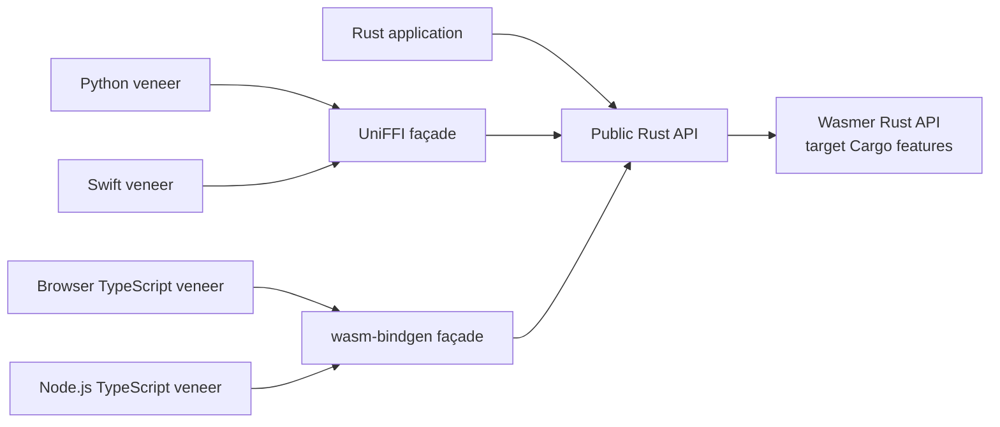

# Universal Wasmer SDK: public API design

Status: complete draft for review  
Last updated: 2026-07-27

## 1. Product idea

The universal Wasmer SDK is an embedded, package-first sandbox API.

It should feel as immediate as a hosted code sandbox while retaining the things
that make Wasmer distinct:

- applications ship as versioned Wasmer packages rather than as assumptions
  about software installed on the host;
- execution can happen locally in a browser, Node.js, a Rust service, Python,
  Swift, or another UniFFI host;
- a sandbox is a stateful virtual OS context for an explicit lifetime, not
  merely one function call;
- the same package model can cover interpreters, CLIs, shells, servers,
  databases, and composed applications;
- policy and target limitations are inspectable rather than hidden.

The SDK is not a compatibility wrapper around Docker, a remote VM service, or
the host process table. It is an ergonomic public API over the Phase 1 Wasmer
package and WASI/WASIX architecture.



There is one semantic center: the public Rust API. Generated bindings and
handwritten language veneers translate types and conventions; they do not
reimplement sandbox behavior.

## 2. Design character

The intended feel is **small, explicit, and composable**.

Small means a developer can remember the common surface:

```text
client.sandboxes.create()
sandbox.installPackage(package)
sandbox.command(command).run()
sandbox.command(command).spawn()
sandbox.sh`command ${value}`.run()
sandbox.fs
sandbox.ports
sandbox.close()
```

Explicit means the API does not guess when a string should be parsed by a
shell, forward the host environment, mount the current directory, grant
network access, or turn a guest port into a public service.

Composable means higher-level features—code interpreters, agent tools, build
pipelines, notebooks, local dev environments—are recipes over the same
primitives rather than special execution paths.

### 2.1 Progressive disclosure

The first successful program introduces the one object that owns execution:

```ts
const client = new Wasmer();
await using sandbox = await client.sandboxes.create({
  packages: ["python/python@3.12"],
});
const output = await sandbox
  .command("python", ["-c", "print('hello')"])
  .run({ check: true });
console.log(output.text());
```

The next level should not require relearning the product:

```ts
await using sandbox = await client.sandboxes.create({
  packages: ["python/python@3.12"],
});

await sandbox.fs.writeText("/workspace/main.py", "print('hello')");
const output = await sandbox
  .command("python", ["main.py"])
  .run({ check: true });
```

Only users who need a live process should meet streams, process IDs,
termination, PTYs, or port forwarding.

## 3. Shared vocabulary

### `Wasmer`

An SDK instance owns host-side configuration: registry endpoints and
credentials, caches, package resolution, target integrations, and defaults.
It is cheap to share and safe to use concurrently.

There is no mutable global runtime. Browser JavaScript uses an async factory
because loading Wasm and workers is asynchronous; Rust construction is
synchronous unless a configured integration requires otherwise.

### `Package`

An immutable, resolved Wasmer package with a manifest, commands, dependencies,
content identity, and compatibility requirements.

A package source may be:

- a registry specification such as `python/python@3.12`;
- an exact version or content digest;
- WEBC bytes;
- a URL when URL acquisition is explicitly enabled;
- a native filesystem path on targets that support it;
- an already resolved `Package`.

Loading or inspecting a package does not execute it.

### `CommandRef`

An unambiguous reference to a command exported by a package. Sandboxes also
make non-conflicting installed command names available through a virtual
`PATH`.

If two installed packages export the same command name, selecting that bare
name fails with an ambiguity report. An explicit `CommandRef` remains
deterministic.

### `Command`

A process-free execution description created by `sandbox.command()`,
`sandbox.sh`, or `sandbox.shell()`. It contains the selected program,
arguments, environment overrides, and working directory, but it is not a
running process. JavaScript exposes it as an immutable reusable value; Rust
exposes the same concept as a conventional mutable builder.

`Command.run()` starts a process and returns bounded completed output.
`Command.spawn()` starts a process and returns live ownership. Reusing a
JavaScript `Command` starts an independent process each time.

### `Sandbox`

A mutable, isolated virtual OS context with:

- a writable `/workspace`, which is the default working directory;
- a writable `/tmp`;
- an installed package set and virtual command set;
- a filesystem and explicit mounts;
- environment values supplied by the application;
- a process table;
- resource and network policies;
- optional virtual networking and port facilities.

It does not inherit the host working directory, files, environment, processes,
or network.

Its mutable state lasts until `close()`. State outlives the sandbox only when
it is stored in an explicitly persistent mounted filesystem; “long-lived”
does not imply a hidden remote persistence service.

### `Process`

A live command execution. It owns standard I/O, exit state, usage accounting,
and explicit graceful and forced termination operations.

### `Output`

The completed, bounded result of `Command.run()` or `process.wait()`: exit
status, captured stdout and stderr, truncation metadata, and resource usage.

`Output.text()` is the checked stdout convenience: it calls `check()` and then
decodes stdout as UTF-8. `CapturedOutput.text()` decodes already captured bytes
synchronously without changing exit behavior.

A guest program exiting with code 1 is a valid `Output`. Resolution failures,
policy violations, unsupported capabilities, and SDK failures are errors.

### `Directory`

A portable mutable filesystem value that can be populated, mounted into
sandboxes, and—when explicitly requested—shared between them. Native
host-directory mounts are a separate target-dependent type.

## 4. One execution model

### 4.1 Short-lived use

Code evaluation, a compiler invocation, a CLI transformation, and any other
independent command use an ordinary sandbox:

```ts
await using sandbox = await client.sandboxes.create({
  packages: ["python/python@3.12"],
});

const output = await sandbox.command(
  "python",
  ["-c", "print(sum(range(10)))"],
).run({
  check: true,
  timeoutMs: 5_000,
});
```

This visibly:

1. resolves and installs the requested packages;
2. creates a fresh sandbox with files, mounts, policy, environment, and
   limits;
3. runs one command and captures bounded output;
4. closes the sandbox at the end of the scope.

There is no hidden one-shot sandbox type and no top-level `Wasmer.run()`.
The explicit sandbox is the security, state, process-ownership, and cleanup
boundary even when only one command executes.

### 4.2 Session use

The same sandbox type supports multiple commands, generated files, package
installation, REPLs, servers, databases, and agent sessions:

```ts
await using sandbox = await client.sandboxes.create({
  limits: {
    memoryBytes: 512 * 1024 * 1024,
    maxProcesses: 16,
  },
});

await sandbox.installPackage("python/python@3.12");
await sandbox.installPackage("wasmer/bash@1.0.25", {
  asShell: "bash",
});
await sandbox.fs.writeText("/workspace/main.py", "print('persistent')");
const first = await sandbox
  .command("python", ["main.py"])
  .run({ check: true });
const second = await sandbox.sh`ls -la /workspace`.run({
  check: true,
});
```

The sandbox remains alive until `close()`. Closing it terminates remaining
processes, closes port bridges, flushes owned filesystem state, and releases
runtime resources.

## 5. Command semantics

### 5.1 `command`, `run`, `spawn`, `sh`, and `shell`

`command`, `run`, and `spawn` carry one meaning in every language. JavaScript
adds `sh` and `shell()` as command-building conveniences because tagged
templates can make interpolation safe:

| Operation | Input | Returns | Shell parsing | Typical use |
| --- | --- | --- | --- | --- |
| `command` | program plus argument list | immutable `Command` description | No | Describe argv execution |
| `Command.run` | run options | completed `Output` | No | Scripts, tools, tests |
| `Command.spawn` | spawn options | live `Process` | No | Streams, servers, REPLs |
| `sh` | tagged template | `Command` using the configured shell | Literal syntax only; interpolations become escaped arguments | Safe shell composition |
| `shell` | opaque script text | `Command` using the configured shell | Yes | Trusted static scripts |

JavaScript:

```ts
await sandbox.command("python", ["-c", userCode]).run({ check: true });
await sandbox.command("python", ["-i"]).spawn({
  terminal: true,
});
await sandbox.sh`find /workspace -type f | sort`.run({ check: true });
```

Rust:

```rust
sandbox.command("python").args(["-c", user_code]).output().await?;
sandbox.command("python").arg("-i").terminal(true).spawn().await?;
sandbox.command("bash")
    .args(["-lc", "find /workspace -type f | sort"])
    .output()
    .await?;
```

Rust keeps shell invocation visible as ordinary argv. Python and Swift veneers
may add an escaped shell builder only if they can preserve the same semantics;
the Rust core does not need a special shell execution path.

The program supplied to `command()` is never tokenized. `sh` and `shell()`
exist only when the sandbox has an explicitly configured shell provider from
an installed package. They never install or assume a host shell.

Tagged interpolation is safe by default:

```ts
const userQuery = "hello; rm -rf /";
await sandbox.sh`grep -r ${userQuery} /workspace`.run({ check: true });
```

The interpolated value becomes one shell argument; its punctuation cannot
become shell syntax. An interpolated array expands to multiple individually
escaped arguments. `shell(script)` is the escape hatch for trusted opaque
script text and performs no interpolation protection.

### 5.2 Command resolution

Commands may be selected in three ways:

1. an installed, non-conflicting command name such as `"python"`;
2. an explicit `CommandRef`, for example
   `python.command("python")`;
3. a `Package`, meaning its declared entrypoint.

An explicit command reference resolves packages that export multiple commands
or disambiguates packages that export the same command name:

```ts
const toolbox = await client.packages.load("namespace/toolbox@1.2.3");
await using sandbox = await client.sandboxes.create({
  packages: [toolbox],
});

await sandbox
  .command(toolbox.command("formatter"), ["src/main.c"])
  .run({ check: true });
```

Selecting a package without an entrypoint fails with
`PACKAGE_HAS_NO_ENTRYPOINT`; callers never need a non-null assertion:

```ts
const edgejs = await client.packages.load("wasmer/edgejs-quickjs@0.0.3");
await sandbox.command(edgejs, ["main.js"]).run({ check: true });
```

The package must already be installed in that sandbox. A resolved but
uninstalled package fails with `PACKAGE_NOT_INSTALLED`.

### 5.3 Defaults

- working directory: `/workspace`;
- stdin: closed unless input or a live writer is supplied;
- stdout/stderr capture: bounded, with a documented conservative default;
- environment: a minimal SDK-defined guest environment plus explicit values;
- network: disabled;
- host mounts: none;
- command timeout: a documented safety default for captured execution;
  sandbox resource limits are configured by the application.

The final byte and timeout defaults will be chosen from Phase 3 measurements
and remain configurable.

## 6. JavaScript and TypeScript API

The browser and Node.js packages expose the same TypeScript contract from
different target entrypoints. `@wasmer/sdk2` may select the correct entrypoint
through package exports, while `@wasmer/sdk2/browser` and
`@wasmer/sdk2/node` remain available for explicit builds.

The following declarations describe the intended surface, not final
implementation syntax.

### 6.1 Client and packages

```ts
export class Wasmer implements AsyncDisposable {
  constructor(options?: WasmerOptions);

  /** Compatibility factory for eager initialization. */
  static create(options?: WasmerOptions): Promise<Wasmer>;

  readonly capabilities: Capabilities;
  readonly packages: Packages;
  readonly sandboxes: Sandboxes;

  ready(): Promise<this>;
  preflight(options?: SandboxOptions): Promise<PreflightReport>;
  close(): Promise<void>;
  [Symbol.asyncDispose](): Promise<void>;
}

export interface Packages {
  load(source: PackageSource): Promise<Package>;
}

export interface Sandboxes {
  create(options?: SandboxOptions): Promise<Sandbox>;
}

export interface WasmerOptions {
  projectRoot?: string;
  registry?: RegistryOptions;
  cache?: false | "memory" | CacheOptions;
  log?: LogSink;
  defaults?: {
    limits?: Limits;
    network?: NetworkPolicy;
  };
}

export interface CacheOptions {
  directory?: string;
  namespace?: string;
  packages?: boolean;
  compiled?: boolean;
  readOnly?: boolean;
  maxBytes?: number;
  compiledTrust?: "local-authenticated" | "disabled";
}

export type PackageSource =
  | string
  | URL
  | Uint8Array
  | Package
  | { path: string };

export type CommandSelector = string | CommandRef | Package;

export class Package {
  readonly id: string;
  readonly digest: string;
  readonly manifest: PackageManifest;
  readonly entrypoint: CommandRef | undefined;

  command(name: string): CommandRef;
}
```

`new Wasmer()` is synchronous and target initialization is lazy. The first
asynchronous operation awaits the shared initialization promise, so there is
no required side-effectful `init()` call. Call `await client.ready()` only when
eager initialization or early startup-error reporting is useful.

On native desktop and Node.js targets, no configuration uses a project-local
`.wasmer` cache beneath the working directory captured by `new Wasmer()`.
Package blobs are content-addressed; compiled entries are separated by target
and engine fingerprint. Browsers use a namespaced IndexedDB-equivalent, and
iOS uses the application cache container. See the dedicated
[cache design](cache-design.md) for layout, trust, concurrency, and eviction.

### 6.2 Sandbox

```ts
export class Sandbox implements AsyncDisposable {
  readonly id: string;
  readonly fs: FileSystem;
  readonly ports: Ports;
  readonly capabilities: Capabilities;

  command(command: CommandSelector, options?: CommandOptions): Command;
  command(
    command: CommandSelector,
    args: readonly string[],
    options?: CommandOptions,
  ): Command;

  readonly sh: ShellTag;
  shell(script: string, options?: CommandOptions): Command;

  installPackage(
    source: PackageSource,
    options?: InstallPackageOptions,
  ): Promise<Package>;
  close(): Promise<void>;
  [Symbol.asyncDispose](): Promise<void>;
}

export interface SandboxOptions {
  packages?: readonly PackageSource[];
  files?: FileSeed;
  mounts?: readonly Mount[];
  env?: Readonly<Record<string, string>>;
  cwd?: string;
  limits?: Limits;
  network?: NetworkPolicy;
  minimumEnforcement?: EnforcementLevel;
  metadata?: Readonly<Record<string, string>>;
  shell?: CommandSelector;
}

export interface CommandOptions {
  env?: Readonly<Record<string, string>>;
  cwd?: string;
}

export interface InstallPackageOptions {
  // Select one command exported by this package as the sandbox's shell.
  asShell?: string;
}

export type ShellValue =
  | string
  | number
  | URL
  | readonly (string | number | URL)[];

export interface ShellTag {
  (
    strings: TemplateStringsArray,
    ...values: readonly ShellValue[]
  ): Command;
}

export class Command {
  run(options?: RunOptions): Promise<Output>;
  spawn(options?: SpawnOptions): Promise<Process>;
}
```

`Command` is an immutable execution description and may be reused. Calling
`run()` or `spawn()` starts a new process each time.

`installPackage()` uses the same source types and resolver as
`sandboxes.create({ packages })`. It resolves and validates the complete package
before atomically extending the sandbox's read-only package layers and command
set:

```ts
await using sandbox = await client.sandboxes.create();

const python = await sandbox.installPackage("python/python@3.12");

const output = await sandbox
  .command(python.command("python"), [
    "-c",
    "print('installed after creation')",
  ])
  .run({ check: true });
```

Installation never runs an entrypoint or package-provided setup script.
Existing processes keep running. Commands started after installation see the
new package. If resolution, compatibility validation, or installation fails,
the sandbox remains unchanged. Installing the same exact package again is
idempotent. Command-name collisions do not make installation order
significant: the bare name becomes ambiguous and an explicit
`package.command(name)` remains available.

The shell convenience has the same explicit provenance. A shell can be
selected from creation-time packages with `SandboxOptions.shell`, or from a
dynamically installed package:

```ts
await sandbox.installPackage("wasmer/bash@1.0.25", {
  asShell: "bash",
});

const output = await sandbox.sh`printf "%s\\n" ${userValue}`.run({
  check: true,
});

await sandbox.shell(`
  set -eu
  make build
  make test
`).run({ check: true });
```

The selected command must implement the documented POSIX-style `-c` contract.
Without a configured shell, `sh` and `shell()` fail with
`SHELL_NOT_CONFIGURED`.

`await using` is a welcome convenience where explicit resource management is
available:

```ts
await using sandbox = await client.sandboxes.create();
```

Documentation also shows universally compatible deterministic cleanup:

```ts
const sandbox = await client.sandboxes.create();
try {
  // ...
} finally {
  await sandbox.close();
}
```

### 6.3 Run options and output

```ts
export interface RunOptions {
  stdin?: string | Uint8Array;
  timeoutMs?: number;
  outputBytes?: number;
  check?: boolean;
}

export interface SpawnOptions {
  timeoutMs?: number;
  outputBytes?: number;
  stdin?: "pipe" | "closed";
  stdout?: "pipe" | "discard";
  stderr?: "pipe" | "discard";
  terminal?: boolean | TerminalOptions;
}

export class Output {
  readonly ok: boolean;
  readonly exitCode: number | null;
  readonly signal: string | null;
  readonly reason:
    | "exited"
    | "signaled"
    | "terminated"
    | "timeout"
    | "limit-exceeded";
  readonly exceededLimit: keyof Limits | null;
  readonly stdout: CapturedOutput;
  readonly stderr: CapturedOutput;
  readonly usage: ResourceUsage;

  check(): this;
  text(encoding?: "utf-8"): string;
}

export class CapturedOutput {
  readonly bytes: Uint8Array;
  readonly truncated: boolean;
  text(encoding?: "utf-8"): string;
}
```

`run()` is the concise form when all input is already available:

```ts
const output = await sandbox.command(
  "python",
  ["-c", "import sys; print(sys.stdin.read().upper())"],
).run({
  stdin: "hello\n",
  check: true,
});
```

For `spawn()`, stdin defaults to `"closed"` and stdout/stderr default to
`"pipe"`. This prevents a child from waiting forever for input that the
application never intended to provide. A discarded stream is explicit.

`check()` returns the same output when successful and throws a
`ProcessExitError` containing the output otherwise:

```ts
const output = await sandbox.command("tests").run({ check: true });
console.log(output.text());
```

Output is bytes first. Text decoding is explicit because compiler artifacts,
images, protocol frames, and invalid UTF-8 are legitimate output.
`CapturedOutput.text()` is synchronous because capture is already complete.
`Output.text()` is sugar for `output.check().stdout.text()`.

`run({ check: true })` performs the same check before resolving. It changes
error behavior, not the return type: successful calls still return `Output`,
and the thrown `ProcessExitError` still contains the completed output.

`RunOptions.outputBytes` is applied to the internal process before it starts.
For live processes, the equivalent bound is `SpawnOptions.outputBytes`.

Once a process has started, an exit, signal, requested termination, timeout, or
resource-limit event is represented by `Output.reason`, preserving captured
diagnostics. `check()` converts every non-success reason into a typed
`ProcessExitError`. Failures to resolve or start the process remain ordinary
SDK errors.

### 6.4 Live process and terminal

```ts
export class Process {
  readonly id: number;
  readonly stdin: WritableBytes | null;
  readonly stdout: ReadableBytes | null;
  readonly stderr: ReadableBytes | null;
  readonly terminal: Terminal | null;

  wait(options?: {
    signal?: AbortSignal;
  }): Promise<Output>;
  terminate(options?: { gracePeriodMs?: number }): Promise<void>;
  kill(): Promise<void>;
}

export class ReadableBytes implements AsyncIterable<Uint8Array> {
  [Symbol.asyncIterator](): AsyncIterator<Uint8Array>;
  lines(options?: {
    encoding?: "utf-8";
    keepNewline?: boolean;
  }): AsyncIterable<string>;
  toReadableStream(): ReadableStream<Uint8Array>;
}

export class WritableBytes {
  write(data: string | Uint8Array): Promise<void>;
  close(): Promise<void>;
  toWritableStream(): WritableStream<Uint8Array>;
}

export class Terminal {
  readonly readable: ReadableBytes;
  readonly writable: WritableBytes;
  resize(columns: number, rows: number): Promise<void>;
}
```

A PTY merges terminal output by design; `stdout` and `stderr` are `null` when
`terminal` is present. `terminate()` asks the guest to exit and may escalate
after the grace period. `kill()` is immediate forced termination.

SDK byte streams guarantee async iteration and provide Web Stream adapters for
interoperability. `lines()` incrementally decodes across chunk boundaries and
never assumes that one byte chunk is one line. Streams are single-consumer:
iteration, `lines()`, or `toReadableStream()` claims the read side.

Closing piped stdin sends EOF to the guest:

```ts
const process = await sandbox.command(
  "python",
  ["-u", "worker.py"],
).spawn({
  stdin: "pipe",
});

await process.stdin!.write("first request\n");
await process.stdin!.write("second request\n");
await process.stdin!.close(); // EOF

const output = await process.wait();
```

Applications should consume stdout and stderr concurrently while the process
runs. A guest can block when an unread pipe reaches its bounded capacity, just
like a native subprocess. The SDK applies bounded retention for diagnostics;
it does not silently turn a live stream into unbounded memory.

Aborting `wait()` stops waiting but leaves the owned process controllable. It
does not guess whether the caller meant graceful or forced termination.
`Command.run()` is defined in terms of a sandbox-owned process, so
foreign-promise cancellation is never the only process-control mechanism.

For a spawned process, piped output is retained from process start up to
`SpawnOptions.outputBytes`, so `wait()` can return a complete bounded `Output`
even when the application observed chunks live. Reading a stream does not make
the final diagnostics disappear. The limit cannot be supplied retroactively
to `wait()`.

### 6.5 Filesystem

```ts
export interface FileSystem {
  readFile(path: string): Promise<Uint8Array>;
  readText(path: string, options?: { encoding?: "utf-8" }): Promise<string>;
  writeFile(path: string, data: Uint8Array): Promise<void>;
  writeText(path: string, data: string): Promise<void>;
  mkdir(path: string, options?: { recursive?: boolean }): Promise<void>;
  readDir(path: string): Promise<readonly DirectoryEntry[]>;
  stat(path: string): Promise<FileStat>;
  remove(path: string, options?: { recursive?: boolean }): Promise<void>;
  rename(from: string, to: string): Promise<void>;
}

export type FileSeed =
  | Readonly<Record<string, string | Uint8Array>>
  | Directory;

export class Directory {
  static create(files?: FileSeed): Promise<Directory>;
  // The same filesystem operations as FileSystem.
}
```

Paths are absolute guest paths in the core contract. In
`SandboxOptions.files`, relative keys resolve against `/workspace`; absolute
keys remain absolute. In `Directory.create()`, relative keys resolve against
that directory's root. JavaScript filesystem methods accept both absolute
paths and paths relative to `/workspace`, normalize them predictably, and
report the resolved guest path in errors.

```ts
await using sandbox = await client.sandboxes.create({
  files: {
    "main.py": "print('hello')",          // /workspace/main.py
    "/etc/app/config.json": "{}",         // remains absolute
  },
});
```

### 6.5.1 Mountable filesystem providers

`Directory` is one filesystem implementation, not the only possible mount
source. The SDK also exposes a provider boundary for browser handles,
application-defined storage, databases, encrypted filesystems, and native
integrations:

```ts
export interface FileSystemProvider {
  capabilities(): FileSystemProviderCapabilities;

  stat(path: string): Promise<FileStat>;
  readDir(path: string): Promise<readonly DirectoryEntry[]>;
  open(
    path: string,
    options: FileOpenOptions,
  ): Promise<FileSystemProviderFile>;

  mkdir(path: string): Promise<void>;
  remove(
    path: string,
    options?: { recursive?: boolean },
  ): Promise<void>;
  rename(from: string, to: string): Promise<void>;
  flush?(): Promise<void>;
}

export interface FileSystemProviderFile {
  read(offset: number, length: number): Promise<Uint8Array>;
  write(offset: number, data: Uint8Array): Promise<number>;
  truncate(length: number): Promise<void>;
  flush(): Promise<void>;
  close(): Promise<void>;
}

export interface FileSystemProviderCapabilities {
  readonly read: boolean;
  readonly write: boolean;
  readonly create: boolean;
  readonly remove: boolean;
  readonly rename: boolean;
  readonly randomAccess: boolean;
  readonly symlinks: boolean;
  readonly persistence: "ephemeral" | "persistent" | "external";
}

export interface FileOpenOptions {
  readonly read?: boolean;
  readonly write?: boolean;
  readonly create?: boolean;
  readonly createNew?: boolean;
  readonly truncate?: boolean;
  readonly append?: boolean;
}

export class MountableFileSystem {
  static fromProvider(
    provider: FileSystemProvider,
  ): Promise<MountableFileSystem>;
}

// Exported only by the browser entrypoint.
export class BrowserFileSystem extends MountableFileSystem {
  static fromDirectoryHandle(
    handle: FileSystemDirectoryHandle,
    options?: { access?: "read-only" | "read-write" },
  ): Promise<BrowserFileSystem>;

  static importDirectory(
    handle: FileSystemDirectoryHandle,
  ): Promise<Directory>;
}
```

Provider paths are normalized UTF-8 paths relative to the provider root. They
never contain `..`, NUL, a host drive prefix, or the sandbox mount point. For
example, guest `/project/src/main.rs` is presented to a provider mounted at
`/project` as `src/main.rs`.

The SDK, rather than the provider, owns:

- mount-point resolution and prevention of path escape;
- intersection of provider capabilities with mount mode;
- descriptor identity and lifetime;
- quotas and bounded operation sizes;
- mapping provider failures to stable filesystem error codes;
- serialization rules for conflicting operations;
- structured diagnostics and permission-loss events.

The provider is trusted host/application code. The guest remains untrusted.
Provider methods may not call back into the same sandbox operation
reentrantly; the SDK detects and rejects such cycles rather than deadlocking.
An operation unsupported by the provider returns a typed `UNSUPPORTED`
filesystem error; unexpected JavaScript exceptions become `IO_ERROR` with the
original cause retained for host diagnostics. Reads and writes cross the
boundary in bounded chunks rather than whole-file copies.

### 6.5.2 Browser File System API

The browser package includes a provider for
`FileSystemDirectoryHandle`, including an origin-private filesystem root:

```ts
import {
  BrowserFileSystem,
  Wasmer,
} from "@wasmer/sdk2/browser";

const handle = await window.showDirectoryPicker({
  mode: "readwrite",
});

const project = await BrowserFileSystem.fromDirectoryHandle(handle, {
  access: "read-write",
});

await using sandbox = await client.sandboxes.create({
  packages: ["python/python@3.12"],
  mounts: [{
    guest: "/project",
    fileSystem: project,
    mode: "read-write",
  }],
});
```

The application obtains the handle because a picker and permission request
normally require a user gesture. `BrowserFileSystem` checks the granted
permission, derives capabilities, and transfers the handle to the SDK worker
when supported. It does not display permission UI during an unrelated guest
filesystem operation.

OPFS needs no visible directory picker:

```ts
const opfsRoot = await navigator.storage.getDirectory();
const persistent = await BrowserFileSystem.fromDirectoryHandle(opfsRoot, {
  access: "read-write",
});
```

Browser File System API access requires a secure context and remains
capability-gated by browser support. A read-only mount stays read-only even if
the underlying handle has write permission. If permission is later revoked,
operations fail as permission errors and the sandbox emits a structured
provider event.

`BrowserFileSystem` is a live external mount. For an intentional copy instead:

```ts
const imported = await BrowserFileSystem.importDirectory(handle);
```

The copy is portable but does not observe later external changes. A requested
live mount never silently becomes an imported copy.

### 6.5.3 Mount descriptors

Portable directories, filesystem providers, and host paths remain visually
distinct:

```ts
type Mount =
  | { guest: string; directory: Directory; mode?: "read-only" | "read-write" }
  | {
      guest: string;
      fileSystem: MountableFileSystem;
      mode?: "read-only" | "read-write";
    }
  | {
      guest: string;
      host: { path: string };
      mode?: "read-only" | "read-write";
    };
```

The host form is unavailable in browsers and may be restricted on iOS. A host
mount defaults to read-only because a typo in guest code should not modify the
developer's checkout.

The generic provider form does not make host paths less explicit:
`MountableFileSystem.fromProvider()` accepts operations, not a path string.
Native path authority continues to require the `host` form or
`HostFileSystem.open()`.

### 6.6 Limits, policy, and capabilities

```ts
export interface Limits {
  cpuTimeMs?: number;
  memoryBytes?: number;
  filesystemBytes?: number;
  maxProcesses?: number;
  maxThreads?: number;
  maxOpenFiles?: number;
}

export type NetworkPolicy =
  | { mode: "disabled" }
  | { mode: "host" }
  | {
      mode: "restricted";
      allow: readonly NetworkRule[];
    };

export interface Capabilities {
  readonly target: "browser" | "node" | "native" | "ios";
  readonly threads: Availability;
  readonly subprocesses: Availability;
  readonly pty: Availability;
  readonly hostMounts: Availability;
  readonly externalFileSystems: Availability;
  readonly browserFileSystemHandles: Availability;
  readonly guestNetworking: Availability;
  readonly restrictedNetworking: Availability;
  readonly localPortForwarding: Availability;
  readonly enforcement: EnforcementReport;
}
```

`Availability` carries more than a Boolean: supported, unsupported, or
conditional, plus a reason and remediation where known.

`preflight()` accepts the same environment description as `sandboxes.create()`.
It combines target capabilities with every package requirement, mount, and
requested policy:

```ts
const report = await client.preflight({
  packages: ["namespace/postgres@<tested-pin>"],
  network: { mode: "disabled" },
  limits: { memoryBytes: 512 * 1024 * 1024 },
});

if (!report.compatible) {
  console.error(report.issues);
}
```

If the caller requests `minimumEnforcement: "hard"` for memory and the target
can provide only cooperative accounting, sandbox creation fails. It does not
quietly weaken the request.

### 6.7 Guest ports

```ts
export interface Ports {
  wait(port: number, options?: { timeoutMs?: number }): Promise<void>;
  connect(port: number): Promise<DuplexConnection>;
  forward(
    port: number,
    options?: { host?: string; localPort?: number },
  ): Promise<PortForward>;
}

export interface PortForward extends AsyncDisposable {
  readonly url: URL;
  readonly localPort: number;
  close(): Promise<void>;
}
```

`connect()` is the most portable abstraction: communicate with a guest service
through the SDK. `forward()` asks a capable native target for a loopback
listener. It is not a public deployment service, and it fails with
`CAPABILITY_UNAVAILABLE` when the target cannot safely provide one.

Disabled guest networking still permits communication within the sandbox and
through an SDK-owned connection to a declared guest port. It denies guest
connections to external hosts. A target's capability report states which
internal and external networking forms are available.

## 7. Rust API

Rust is the semantic source of truth. The API is asynchronous where guest
execution, package acquisition, or filesystem operations may wait, while
configuration uses builders.

The exact executor integration will be validated in Phase 3. Public futures
should not require consumers to know which Wasmer Cargo feature selected the
target runtime.

### 7.1 Client

```rust
use wasmer_sdk::{Result, Wasmer, WasmerConfig};

let wasmer = Wasmer::new(WasmerConfig::default())?;

let package = wasmer
    .packages()
    .load("python/python@3.12")
    .await?;

let report = wasmer
    .sandboxes().create()
    .package(package)
    .memory_limit(512 * 1024 * 1024)
    .preflight()
    .await?;
```

Proposed core shape:

```rust
pub struct Wasmer { /* shared internals */ }

impl Wasmer {
    pub fn new(config: WasmerConfig) -> Result<Self>;
    pub fn capabilities(&self) -> &Capabilities;
    pub fn packages(&self) -> Packages;
    pub fn sandboxes(&self) -> Sandboxes;
    pub async fn shutdown(&self) -> Result<()>;
}

impl Packages {
    pub async fn load(
        &self,
        source: impl Into<PackageSource>,
    ) -> Result<Package>;
}

impl Sandboxes {
    pub fn create(&self) -> SandboxBuilder;
}
```

`Wasmer` is cloneable as a shared handle. `shutdown()` closes the shared client
and makes every clone reject new work, allowing worker pools and caches to be
flushed deterministically. Dropping the last handle performs best-effort
cleanup.

### 7.2 Sandbox builder

```rust
let sandbox = wasmer
    .sandboxes().create()
    .package("python/python@3.12")
    .package("wasmer/bash@1.0.25")
    .file("/workspace/main.py", b"print('hello')")
    .memory_limit(512 * 1024 * 1024)
    .network(NetworkPolicy::Disabled)
    .await?;

let output = sandbox
    .command("python")
    .args(["-c", "print(sum(range(10)))"])
    .timeout(std::time::Duration::from_secs(5))
    .output()
    .await?;
```

The builder accepts resolved `Package` values as well as package sources. It
creates a process-free environment; commands can only be constructed from an
open `Sandbox`.

### 7.3 Commands

Rust intentionally resembles `std::process::Command`:

```rust
let output = sandbox
    .command("python")
    .arg("/workspace/main.py")
    .env("MODE", "test")
    .current_dir("/workspace")
    .input("input\n")
    .output()
    .await?;

if !output.status.success() {
    // Nonzero status is data.
}

let output = output.check()?;
let text = output.text()?;
```

Rust `Output::text()` mirrors the JavaScript convenience: it checks the exit
status and synchronously decodes captured stdout. Call
`output.stdout.text()` when decoding should not imply a successful exit.

Proposed shape:

```rust
impl Sandbox {
    pub fn command(&self, command: impl Into<CommandSelector>)
        -> Command<'_>;
    pub async fn install_package(
        &self,
        source: impl Into<PackageSource>,
    ) -> Result<Package>;
    pub fn fs(&self) -> &FileSystem;
    pub fn ports(&self) -> &Ports;
    pub fn capabilities(&self) -> &Capabilities;

    pub async fn close(&self) -> Result<()>;
}

impl Command<'_> {
    pub fn arg(&mut self, arg: impl Into<String>) -> &mut Self;
    pub fn args<I, S>(&mut self, args: I) -> &mut Self;
    pub fn env(&mut self, key: impl Into<String>, value: impl Into<String>)
        -> &mut Self;
    pub fn current_dir(&mut self, path: impl Into<PathBuf>) -> &mut Self;
    // Finite input convenience for output().
    pub fn input(&mut self, input: impl Into<Bytes>) -> &mut Self;

    // Live stdio configuration for spawn().
    pub fn stdin(&mut self, mode: Stdio) -> &mut Self;
    pub fn stdout(&mut self, mode: Stdio) -> &mut Self;
    pub fn stderr(&mut self, mode: Stdio) -> &mut Self;
    pub fn timeout(&mut self, duration: Duration) -> &mut Self;
    pub fn terminal(&mut self, enabled: bool) -> &mut Self;

    pub async fn output(&mut self) -> Result<Output>;
    pub async fn spawn(&mut self) -> Result<Process>;
}

pub enum Stdio {
    Piped,
    Null,
}
```

The real signatures may consume the builder instead of borrowing it if that
produces clearer ownership through UniFFI. The behavior is the contract.
`install_package()` performs the same atomic installation as the JavaScript
method and returns the resolved package. Stdin defaults to `Stdio::Null`;
stdout and stderr default to `Stdio::Piped`. Terminal mode replaces all three
ordinary streams.

### 7.4 Process I/O

```rust
let mut process = sandbox
    .command("python")
    .args(["-u", "/workspace/worker.py"])
    .stdin(Stdio::Piped)
    .spawn()
    .await?;

let mut stdin = process.take_stdin()
    .ok_or(Error::StreamUnavailable)?;
let mut stdout = process.take_stdout()
    .ok_or(Error::StreamUnavailable)?;
let mut stderr = process.take_stderr()
    .ok_or(Error::StreamUnavailable)?;

let stdout_task = tokio::spawn(async move {
    drain_stream(&mut stdout).await
});
let stderr_task = tokio::spawn(async move {
    drain_stream(&mut stderr).await
});

stdin.write_all(b"first request\n").await?;
stdin.write_all(b"second request\n").await?;
stdin.close().await?; // EOF

let output = process.wait().await?;
let stdout_bytes = stdout_task.await??;
let stderr_bytes = stderr_task.await??;
```

The Rust veneer should integrate with the ecosystem's asynchronous read/write
traits when possible and always retain bounded chunk APIs that map safely
through UniFFI.

Taking a stream transfers its read or write handle exactly once. `close()` or
an async-writer shutdown on `ProcessStdin` means EOF, not process
termination. `wait()` waits for process completion; it does not implicitly
close a still-owned stdin handle.

`terminate(grace_period)` and `kill()` are explicit. Dropping a `Process`
handle does not mean “leave an unmanageable process running”; ownership and
sandbox cleanup rules remain deterministic.

### 7.5 Files and mounts

The Rust semantic center defines an object-safe asynchronous filesystem trait.
The exact signatures will be refined against Wasmer during Phase 3, but the
intended boundary is:

```rust
#[async_trait]
pub trait FileSystem: Debug + Send + Sync + 'static {
    fn capabilities(&self) -> FileSystemCapabilities;

    async fn stat(&self, path: &RelativeGuestPath)
        -> FsResult<FileMetadata>;
    async fn read_dir(&self, path: &RelativeGuestPath)
        -> FsResult<Vec<DirectoryEntry>>;
    async fn open(
        &self,
        path: &RelativeGuestPath,
        options: FileOpenOptions,
    ) -> FsResult<Box<dyn File>>;

    async fn create_dir(&self, path: &RelativeGuestPath) -> FsResult<()>;
    async fn remove(
        &self,
        path: &RelativeGuestPath,
        recursive: bool,
    ) -> FsResult<()>;
    async fn rename(
        &self,
        from: &RelativeGuestPath,
        to: &RelativeGuestPath,
    ) -> FsResult<()>;
    async fn flush(&self) -> FsResult<()>;
}

#[async_trait]
pub trait File: Debug + Send + Sync + 'static {
    async fn read_at(&self, offset: u64, length: usize)
        -> FsResult<Bytes>;
    async fn write_at(&self, offset: u64, data: Bytes)
        -> FsResult<usize>;
    async fn set_len(&self, length: u64) -> FsResult<()>;
    async fn flush(&self) -> FsResult<()>;
    async fn close(&self) -> FsResult<()>;
}
```

The production form may use explicit boxed futures instead of
`#[async_trait]`; dynamic mountability and behavior are the contract.
`Directory` and `HostDirectory` implement this trait. Applications can provide
an `Arc<dyn FileSystem>`.

This is intentionally not a public re-export of Wasmer's
`virtual_fs::FileSystem`. The current Wasmer interface combines synchronous
filesystem metadata/directory calls with asynchronous virtual-file I/O. The
SDK needs a stable async contract that maps to JavaScript promises and UniFFI,
then an internal adapter to the Wasmer version selected by Cargo features.

This mismatch is a Phase 3 feasibility gate, not a detail to hide. A browser
implementation must prove a scheduler-safe bridge—such as an upstream
asynchronous VFS path or a worker-owned provider protocol—without blocking the
JavaScript event loop. OPFS synchronous access handles may optimize file I/O in
dedicated workers, but they do not by themselves solve every asynchronous
directory operation or user-selected handle. Until the bridge is proven,
`browserFileSystemHandles` reports conditional or unavailable and preflight
fails a requested live mount.

```rust
sandbox
    .fs()
    .write_text("/workspace/config.toml", "mode = \"test\"\n")
    .await?;

let bytes = sandbox
    .fs()
    .read("/workspace/result.bin")
    .await?;

let assets = Directory::new();
assets.write_text("prompt.txt", "hello").await?;

let sandbox = wasmer
    .sandboxes().create()
    .mount("/assets", assets.clone(), MountMode::ReadOnly)
    .await?;
```

Native-only host paths are visually explicit:

```rust
let sandbox = wasmer
    .sandboxes().create()
    .host_mount(
        "/src",
        HostDirectory::open("./src")?,
        MountMode::ReadOnly,
    )
    .await?;
```

No generic `mount("./src", "/src")` overload should accidentally turn a
portable directory API into host filesystem authority.

An application-defined provider uses the same generic mount:

```rust
let project: Arc<dyn FileSystem> = Arc::new(MyFileSystem::new());

let sandbox = wasmer
    .sandboxes().create()
    .mount("/project", project, MountMode::ReadOnly)
    .await?;
```

Mount mode intersects capabilities: placing a writable provider in a
read-only mount removes guest write, create, rename, and delete rights.
External provider contents remain owned by that provider unless the
application explicitly copies them into a `Directory`.

## 8. Cross-language mapping

The concepts line up while each language keeps its native shape:

| Concept | Rust | JavaScript | Python veneer | Swift veneer |
| --- | --- | --- | --- | --- |
| Configure client | `Wasmer::new(config)` | `new Wasmer(options)` | `Wasmer(config)` / async open | `try await Wasmer(options:)` |
| Create sandbox | `wasmer.sandboxes().create().await` | `client.sandboxes.create()` | `client.sandboxes.create()` | `client.sandboxes.create()` |
| Install package | `sandbox.install_package(source)` | `sandbox.installPackage(source)` | `sandbox.install_package(source)` | `sandbox.installPackage(source:)` |
| Captured command | `sandbox.command(cmd).output()` | `sandbox.command(cmd, args, options).run()` | `sandbox.command(cmd, args=[...]).run()` | `sandbox.command(cmd, args:, options:).run()` |
| Live command | `sandbox.command(cmd).spawn()` | `sandbox.command(cmd, args, options).spawn()` | `sandbox.command(cmd, args=[...]).spawn()` | `sandbox.command(cmd, args:, options:).spawn()` |
| Cleanup | `close().await`, RAII fallback | `close()`, `await using` | `async with` | `close()`, scoped helper |
| Byte stream | async reader/writer | `AsyncIterable` + Web Stream adapter | async iterator/writer | `AsyncSequence`/writer |

Generated UniFFI names are internal implementation details. The handwritten
Python and Swift veneers own the public names, context-management behavior,
exceptions, and stream adapters.

## 9. Errors

The intended v1 error contract gives all SDK errors:

- a stable code;
- the failed operation;
- a human message;
- typed details relevant to the code;
- an optional cause chain;
- sandbox, process, package, and path identifiers when safe and relevant.

The current pre-1.0 implementation exposes a provisional subset through
`Error::code()` and `WasmerError.code`. Those codes are useful for branching
today, but may be split or renamed until each target can classify failures
consistently. In particular, a general package-loading failure must not be
reported as `PACKAGE_NOT_FOUND` unless the underlying cause is known.

Planned v1 families:

```text
CLIENT_CLOSED
SANDBOX_CLOSED
INVALID_ARGUMENT
INVALID_PACKAGE_SOURCE
PACKAGE_NOT_FOUND
PACKAGE_LOAD_FAILED
PACKAGE_INTEGRITY_FAILED
PACKAGE_INCOMPATIBLE
PACKAGE_NOT_INSTALLED
PACKAGE_HAS_NO_ENTRYPOINT
COMMAND_NOT_FOUND
COMMAND_AMBIGUOUS
SHELL_NOT_CONFIGURED
CAPABILITY_UNAVAILABLE
POLICY_DENIED
LIMIT_UNENFORCEABLE
LIMIT_EXCEEDED
TIMEOUT
INVALID_PATH
FILESYSTEM_ERROR
INVALID_UTF8
PROCESS_EXITED
PROCESS_TERMINATED
EXECUTION_ERROR
TASK_ERROR
INTERNAL_ERROR
IO_ERROR
INITIALIZATION_ERROR
TARGET_ERROR
```

Guest exit status is intentionally absent. A command that ran and exited 127
still returns `Output`; a command that could not be resolved returns
`COMMAND_NOT_FOUND`.

`TIMEOUT`, `LIMIT_EXCEEDED`, `PROCESS_EXITED`, and `PROCESS_TERMINATED` are
exposed by `ProcessExitError` when an application calls `Output.check()` or
opts into `run({ check: true })`. By default, `run()` and `wait()` return bounded
`Output`, including termination reason and diagnostics. `Output.ok` is true
only for `reason === "exited"` with exit code zero.

JavaScript:

```ts
try {
  await client.sandboxes.create({
    network: {
      mode: "restricted",
      allow: [{ host: "api.example.com", port: 443 }],
    },
  });
} catch (error) {
  if (
    error instanceof WasmerError &&
    error.code === "CAPABILITY_UNAVAILABLE"
  ) {
    console.error(error.details.capability);
  }
}
```

Rust uses an exhaustive-enough public error code plus structured detail, while
retaining source errors for diagnostics.

## 10. Security expressed through DX

Good DX here includes making authority visible:

- no host environment inheritance;
- no current-directory mount;
- no implicit guest network;
- host mounts are distinct, target-gated, and read-only by default;
- filesystem-provider paths are normalized beneath their mount root;
- a mount cannot grant rights the provider did not declare;
- package registry credentials remain in the host resolver;
- environment variables are documented as visible to all code in the sandbox;
- unsupported policy enforcement fails before execution;
- shell parsing requires explicitly executing an installed shell package;
- output, package extraction, and filesystem growth are bounded;
- every long-lived resource is closeable.

This is an in-process userspace sandbox. The SDK must never describe it as a
VM-strength boundary for hostile native machine code. The safety claim is tied
to WebAssembly isolation, WASI/WASIX mediation, policy enforcement, and the
capabilities of the selected target build.

## 11. Target-specific behavior

The API stays stable; availability does not.

### Browser

- built with the appropriate Wasmer JavaScript feature selection;
- uses Web Workers and browser-compatible streams;
- has no host filesystem mounts;
- can mount an OPFS or permission-granted `FileSystemDirectoryHandle` through
  the browser filesystem provider when the async bridge is available;
- guest networking requires a browser-compatible proxy or virtual network;
- cross-origin isolation and thread availability are reported as conditions,
  not discovered through obscure runtime failures.

### Node.js

- uses the native/Node-target distribution selected in Phase 3;
- can support persistent caches and explicit host mounts;
- loopback port forwarding is capability-gated;
- does not inherit `process.env`, `process.cwd()`, or Node network authority.

### Native Rust and UniFFI desktop hosts

- compile Wasmer with the appropriate native features;
- default to `<project-root>/.wasmer` for package and target-partitioned
  compiled caches;
- can use explicit host mounts and local port forwarding;
- enforcement reports distinguish hard, cooperative, and unavailable limits.

### iOS

- uses the same Rust API beneath a UniFFI façade;
- favors bundled and previously approved package content;
- reports platform constraints on threads, background execution, networking,
  dynamic package acquisition, and executable-content policy;
- never claims a package is supported before device validation.

None of these targets introduces a runtime-backend or host-adapter interface.
The same public Rust API calls Wasmer directly, with Cargo features selecting
the relevant Wasmer implementation and small target modules only where
compilation requires them. UniFFI and `wasm-bindgen` remain façades over that
API.

## 12. Package-oriented recipes, not language APIs

Running Python is package execution:

```ts
await using sandbox = await client.sandboxes.create({
  packages: ["python/python@3.12"],
});
await sandbox
  .command("python", ["-c", "print('hello')"])
  .run({ check: true });
```

Running JavaScript through EdgeJS QuickJS is the same:

```ts
const edgejs = await client.packages.load(
  "wasmer/edgejs-quickjs@0.0.3",
);
await using sandbox = await client.sandboxes.create({
  packages: [edgejs],
  files: {
    "main.js": "console.log('hello')",
  },
});
await sandbox
  .command(edgejs, ["main.js"])
  .run({ check: true });
```

A later `recipes/python` helper may package defaults, decode a conventional
result, or manage dependencies. It must still return standard `Output`,
`Process`, `Directory`, and `Sandbox` values. It is composition, not a
privileged path. Any future short-run recipe is specified as
`sandboxes.create()` + `sandbox.command(...).run()` + `close()`, not as another
core execution model.

## 13. Observability

The initial API should expose enough information to debug a sandbox without
turning the core into a telemetry framework:

- package resolution and content IDs;
- sandbox and process IDs;
- structured lifecycle and policy events;
- execution duration and available resource usage;
- output truncation;
- capability/preflight reports;
- optional host log sink with redaction.

Log sinks receive host control-plane diagnostics, not an automatic duplicate
of guest stdout/stderr. Applications decide how guest output is stored.

## 14. Package identity and cache behavior

Resolved packages expose their exact version and content digest. Applications
that need reproducible execution should retain those exact package references
in their own configuration. `.wasmer/` remains disposable cache state:

```gitignore
.wasmer/
```

Deleting `.wasmer` may cost downloads and compilation time. Compiled artifacts
from another target or engine fingerprint are never considered candidates.

Examples in conceptual documentation may use a stable channel such as
`python/python@3.12`. Release tests and production guides should use a verified
exact version or digest. Package names that have not yet been verified are
shown as placeholders rather than fabricated.

## 15. Deliberately outside the v1 core

- a hidden local-versus-remote execution switch;
- host container or VM management;
- public preview URL provisioning;
- language-specific interpreter objects;
- dependency-install APIs that bypass package commands;
- an SDK-specific terminal renderer;
- a universal “secret” object implemented as guest environment variables;
- automatic host file synchronization;
- claims of fine-grained egress control without an enforcing network path.

These can be built above the SDK or introduced later with explicit capability
and security models.

## 16. Migration from the current Wasmer JS SDK

The proposal preserves the current package/command model while making the
execution boundary explicit.

Current Wasmer JS style:

```ts
await init();
const pkg = await Wasmer.fromRegistry("python/python@3.12");
const entrypoint = pkg.entrypoint;
if (!entrypoint) throw new Error("Package has no entrypoint");
const instance = await entrypoint.run({
  args: ["-c", "print(42)"],
});
const output = await instance.wait();
```

Proposed sandbox-scoped style:

```ts
const client = new Wasmer();
await using sandbox = await client.sandboxes.create({
  packages: ["python/python@3.12"],
});
const output = await sandbox
  .command("python", ["-c", "print(42)"])
  .run({ check: true });
```

For callers that need package inspection, the mapping remains direct:

```ts
const pkg = await client.packages.load("namespace/toolbox@1.2.3");
const command = pkg.command("format");
await using sandbox = await client.sandboxes.create({
  packages: [pkg],
  files: { "main.txt": "source" },
});
const output = await sandbox
  .command(command, ["main.txt"])
  .run({ check: true });
```

Current `Directory` and package command concepts survive. A current
`Instance` maps to either:

- `Output` when the caller only needs completed execution; or
- `Process` when the caller needs live streams, a terminal, or lifecycle
  control.

The principal source migration is replacing global `init()` and static
registry methods with an explicit `Wasmer` instance. That gives registry,
cache, policy defaults, logging, and cleanup a natural owner.

## 17. Research influences

The design preserves Wasmer JS's package, entrypoint, directory, process, and
streaming strengths while making stateful sandboxes a first-class concept.
It also incorporates useful patterns from current sandbox products:

- Vercel's explicit sandbox/session boundary, argv-first commands, and
  persistent environment lifecycle;
- Modal's process streams, command timeout, idle timeout, and readiness model;
- E2B's approachable command, file, and PTY namespaces;
- Daytona's persistent sandbox lifecycle;
- Cloudflare Sandbox's clear completed-command result;
- CodeSandbox SDK's lifecycle concepts;
- Beam's code, process, filesystem, and service workflows;
- Riza's concise code/input/limits workflow;
- agentOS's deny-by-default permissions and virtual OS model;
- `unix-wasm-sandbox` and `wasmer-shell-py` for Unix-like package composition,
  completed-process ergonomics, bounded output, and read-only host mounts;
- WASM OJ Forge for local-first execution, content identities, deterministic
  results, explicit termination reasons, and browser/native conformance.

The universal API intentionally diverges where hosted products can provide
VMs, public URLs, opaque secret injection, hibernation, or account-level
control planes that an embedded SDK cannot honestly promise.

Primary references:

- [Sandbox SDK comparison and API revision](sandbox-sdk-comparison.md)
- [Wasmer JS SDK](https://github.com/wasmerio/wasmer-js)
- [Wasmer JS package execution](https://docs.wasmer.io/sdk/wasmer-js)
- [Wasmer JS filesystem](https://docs.wasmer.io/sdk/wasmer-js/filesystem)
- [Wasmer CLI package execution](https://docs.wasmer.io/runtime/cli)
- [Vercel Sandbox JavaScript SDK](https://vercel.com/docs/sandbox/sdk-reference)
- [Modal Sandbox guide](https://modal.com/docs/guide/sandboxes)
- [E2B JavaScript SDK](https://e2b.dev/docs/sdk-reference/js-sdk/v2.29.1/sandbox)
- [Daytona SDK](https://www.daytona.io/docs/en/typescript-sdk/)
- [Cloudflare Sandbox SDK](https://developers.cloudflare.com/sandbox/api/)
- [CodeSandbox SDK](https://codesandbox.io/docs/sdk)
- [Beam TypeScript SDK](https://docs.beam.cloud/v2/reference/ts-sdk)
- [Riza Code Interpreter API](https://docs.riza.io/reference/run)
- [agentOS SDK](https://agentos-sdk.dev/)
- [unix-wasm-sandbox](https://github.com/tanmay-bakshi/unix-wasm-sandbox)
- [wasmer-shell-py](https://github.com/boweiliu/wasmer-shell-py)
- [WASM OJ Forge](https://github.com/wasm-oj/forge)
- [edx0](https://edx0.dev/)
- [MDN File System API](https://developer.mozilla.org/en-US/docs/Web/API/File_System_API)
- [Wasmer virtual filesystem source](https://github.com/wasmerio/wasmer/blob/v7.1.0/lib/virtual-fs/src/lib.rs)
